

<!-- _class: lead -->

# 🧮 HJ-Gauss

#### Monte-Carlo Hamilton-Jacobi Reachability

**Full Exposition:** From TVD-RK Levelsets to Monte Carlo Sampling for BRTs.

  

<b>Lekan Molu</b> · Amazon IRG

Amazon Robotics · August 18, 2026

with V. Renganathan (Cranfield) and N. Cho (Seoul National University)

---

## 🎯 BLUF (Bottom Line Up Front) — 1/2

> **Grid-resolved Hamilton-Jacobi (HJ) BRTs yield certified safety sets at a $O(M^n)$ memory cost.**

- 🧱 **Background:** LevelSetPy resolves backward reachable sets/tubes by discretizing the HJ PDE (upwinding + Lax-Friedrichs + TVD-RK) on a grid — certified, but exponential in state dimension $n$.

- 🌊 **Idea:** a Cole-Hopf transformation turns the *viscous* HJ PDE into a **linear heat equation**; Feynman-Kac evaluates it as a **Gaussian expectation**. No grid.

> **HJ-Gauss replaces the grid with Gaussian Monte-Carlo, dropping the footprint to $O(N\cdot n)$.**

---

## 🎯 BLUF (Bottom Line Up Front) — 2/2

> **HJ-Gauss replaces the grid with Gaussian Monte-Carlo, dropping the footprint to $O(N\cdot n)$.**

- 🔁 **Generality:** a frozen-coefficient **Picard iteration** handles the nonconvex, state-dependent Hamiltonians of reachability.

- 📐 **Rigor:** $O(N^{-1/2})$ concentration, contraction convergence, a linearization residual bound, and a **conservative safety certificate**.

- 🤖 **For this room:** the windowed reachable tube is a dynamics-aware **conflict predicate** for MAPF; the value gradient is a **score** for diffusion planners.
> **This Gaussian kernel is the diffusion kernel, the bridge to learning-based planners.**

---

## 🧭 Roadmap — Main Talk (Parts 1-5)

| Part | Theme |
|---|---|
| 1 | The wall: curse of dimensionality & prior grid-free work |
| 2 | HJ-Gauss core theory: Cole-Hopf → heat → Feynman-Kac → Picard |
| 3 | Importance sampling & variance control |
| 4 | Guarantees: concentration, contraction, residual, certificate |
| 5 | Experiments (rockets, Dubins, 45D, $10^5$ birds) |

▶️ **Continue:** Parts 6-9 on the next slide.

---

## 🧭 Roadmap — Main Talk (Parts 6-9) & Appendix

| Part | Theme |
|---|---|
| 6 | Application: multi-agent path finding (AMFS) |
| 7 | The diffusion connection |
| 8 | Dirty Laundry: limits & boundaries |
| 9 | Conclusions, future work, references |
| 📚 A–C | Appendix: HJ/viscosity theory (A) · reachability foundations (B) · LevelSetPy grid pipeline (C) |

> The background — **HJ PDE and viscosity theory (A)**, **Reachability Foundations (B)**, and the **LevelSetPy grid pipeline (C)** — is collected in the **Appendix**.

---

## 📏 Notations

| Symbol | Meaning |
|---|---|
| $x\in\Omega\subseteq\mathbb{R}^n$ | $x$: State; $\Omega$: Open set; $n$ = State dimension. |
| $v(t,x)$ | Value function; $v_t$ time derivative; $Dv=\nabla_x v$ spatial gradient (co-state). |
| $H(t;x,p)$ | Hamiltonian; $p$ = co-state. |
| $g(x)$ | Terminal/target datum (signed distance $\ell(x)$); BUC. |
| $\delta>0$ | Viscosity parameter. |

---

## 📏 Notations

| Symbol | Meaning |
|---|---|
| $\omega^\delta=e^{-c v^\delta}$ | Cole-Hopf transformed variable. |
| $c(t;x)$ | Frozen coefficient $=\frac{2}{\delta}H^\delta/\lvert Dv^\delta\rvert^2$. |
| $M,\ N$ | Grid points per dimension ($M$); Monte-Carlo samples per query state ($N$). |
| $\mathcal L_0,\ \mathcal L$ | Target set, backward reachable tube (BRT). |

> **Two independent counts:** $M$ evaluation states (arbitrary, grid-free) vs $N$ Gaussian samples drawn *per state*. Total randomness per iteration $=M\times N$.

---

<!-- _class: part -->

# Part 1
## 🧱 The Wall
**Curse of dimensionality, and who has tried to climb it.**

---

## 🧱 The Curse of Dimensionality, Quantified

Grid memory is $O(M^n)$ with $M$ points per dimension:

| State dim $n$ | $M=100$ cells | Feasibility (double array) |
|---:|---:|:---|
| 2 | $10^{4}$ | ✅ trivial. |
| 3 | $10^{6}$ | ✅ easy. |
| 4 | $10^{8}$ | ⚠️ ~0.8 GB, heavy. |
| 5 | $10^{10}$ | ❌ ~80 GB. |
| 6 | $10^{12}$ | ❌ ~8 TB. |
| 45 (our multi-agent game) | $10^{90}$ | ❌ exceeds atoms in the observable universe. |

- GPU acceleration lowers wall-clock, **not** the exponent.

> Reachability's most valuable regime — many interacting agents, rich dynamics — is where grids are impossible.

---

## 🧱 Attempt 1: PINN Reachability (DeepReach)

- **DeepReach** trains a neural network to minimize the HJ PDE residual directly (physics-informed loss), no reference grid.

- **Pros:** Trades grid storage for network weights; sidesteps $O(M^n)$ memory.

- **Con:** Scales only to moderate dimensiond (reported ~9-10D);
  - And **accuracy degrades** as $n$ grows; training is a nonconvex optimization with no viscosity-solution guarantee.

> **Catch-22:** Learning-based solvers help, but do not deliver a certified, dimension-robust representation.
> **HJ-Gauss** keeps the viscosity-solution semantics.

---

## 🧱 Attempt 2: Convex-Duality Formulas (Hopf / Lax-Oleinik)

> HJ-Gauss trades their exactness for generality, at the quantified price of a linearization residual bound (Part 4).

- **Hopf** and **Lax-Oleinik** formulas1 evaluate the value **pointwise** via convex optimization — grid-free at a point.

- **Limitation:** they require a **convex** (or state-independent) Hamiltonian.

- Reachability's $H(x,p)=\max_u\min_w\langle p,f\rangle$ is **state-dependent and nonconvex** → outside this class.

> It handles the nonconvex, state-dependent Hamiltonian head-on.

1 Darbon-Osher 2016; Chow-Darbon-Osher-Yin 2017; Kirchner 2018

---

## 🧱 Attempts 3-4: Decomposition, Path Integral, Sampling

| Family | Idea | Boundary |
|---|---|---|
| **System decomposition**1 | Remove dimension by splitting self-contained subsystems | Only when coupling structure permits; HJ-Gauss is indifferent to coupling and *complements* it. |
| **Stochastic PDE / path integral**2 | Log-substitution linearizes the **stochastic** HJB under noise-control duality | Diffusion comes from *process noise*; ours is a **deterministic worst-case game**, $\delta$ an analysis parameter. |
| **Sample-based stochastic reachability**3 | Certify **probabilistic** reach-avoid | We certify **adversarial worst-case** reachability — a different, stronger guarantee. |

> **The open gap:** a grid-free, storage-light scheme for **nonconvex, state-dependent, adversarial** Hamiltonians. That is HJ-Gauss.

1 Chen-Herbert · 2 Kappen; Theodorou · 3 Summers-Lygeros; Lesser-Oishi

---

## 🧱 Where HJ-Gauss Sits

- Keeps the **viscosity-solution** semantics (unlike PINN heuristics).

- Handles **nonconvex, state-dependent** $H$ (unlike Hopf/Lax-Oleinik).

- **Indifferent to coupling structure** (complements decomposition).

- Certifies **adversarial worst-case** safety (unlike probabilistic sampling).

- Memory **$O(N\cdot n)$**, grid- and discretization-free.

> The rest is *how*: a Cole-Hopf transformation, a Feynman-Kac expectation, and a frozen-coefficient Picard iteration.

---

<!-- _class: part -->

# Part 2
## 🌊 HJ-Gauss Core Theory

**Cole-Hopf Transformation → Linear Heat Equation**

**↓**

**→ Feynman-Kac Formula → Picard Iteration.**

---

## 🌊 The Theoretical Roadmap of the Method

1. Start from the **viscous** HJ PDE (Part A).
2. Apply a generalized **Cole-Hopf** transform $\omega=e^{-cv}$ → a **Linear heat equation**.
3. Solve the heat equation by its **Gaussian heat kernel** → a **Feynman-Kac expectation**.
4. Recover value (log-sum-exp) and gradient from that expectation.
5. Because $c$ depends on the unknown $Dv$, **iterate**: freeze, solve, update (Picard) = **Algorithm 1**.
6. Analyze exactness (quadratic case) vs the **quasi-linearization residual** (general case).

> Each arrow is a theorem or proposition in the paper; we walk them one by one.

---

## 🌊 The Transformation, and the Closed-Form/Approximate Split

For a general $H$, define the spatially-varying coefficient
$$ c(t;x)=\frac{2}{\delta}\cdot\frac{H^\delta}{|Dv^\delta|^2},\qquad H^\delta:=H(t;x,Dv^\delta), $$
and set $\omega^\delta:=\exp(-c\,v^\delta)$.

- **Quadratic case** $H=\tfrac12|p|^2$: $c=1/\delta$ constant, $\omega^\delta$ solves the **homogeneous heat equation** with **zero residual** — a genuine Cole-Hopf identity.

- **General $H$:** the transform induces a residual $R=R_{\mathrm{alg}}+R_{\mathrm{der}}$;

  - $c$'s choice eliminates the **algebraic** part $R_{\mathrm{alg}}$, leaving the **derivative** part $R_{\mathrm{der}}$.

> No freezing of $c$'s *values* removes its *derivatives*. Hence for nonlinear $H$ this is a **quasi-linearization**, not an identity — and the leftover $R_{\mathrm{der}}$ is the residual we will bound.

---

## 🌊 Picard Quasi-Linearization: The Surrogate View

- At iteration $k$, **freeze** $c^{(k)}$ at the current iterate and solve the linear heat equation **in closed form**.

- Equivalently: replace the true Hamiltonian by the **locally-matched quadratic surrogate**
$$ \tilde H^{(k)}(p)=\tfrac{\delta}{2}\,c^{(k)}\,|p|^2, $$
solve the resulting viscous HJ equation in closed form, obtain $v^{(k+1)}$, update $Dv^{(k+1)}$ and $c^{(k+1)}$.
- **The iteration's limit is the fixed point of the surrogate solve map** — equal to the viscous solution *only* when $R_{\mathrm{der}}\equiv 0$ (the quadratic case).

> "Successive quadratic matching": each step is a locally closed-form quadratic-Hamiltonian solve, refined by re-estimating the co-state.

---

## 🌊 Reduction to the Heat Equation (Proposition)

With $c^{(k)}$ frozen, $\omega^\delta$ solves the heat initial-value problem
$$ \omega_t^\delta-\tfrac{\delta}{2}\Delta\omega^\delta=0\ \text{ in }\mathbb{R}^n\times(0,T],\qquad \omega^\delta(0,x)=\exp(-c\,g(x)). $$

- When $H=\tfrac12|p|^2,\ c=1/\delta$: **closed-form, no residual**.

- For general $H$: discards the derivative residual (Lemma, appendix) — the quasi-linearization.

> A nonlinear, nonconvex, state-dependent HJ PDE has become **the heat equation** — the most classical linear parabolic PDE, with an explicit Gaussian solution.

---

## 🌊 The Gaussian Heat Kernel & Feynman-Kac

The heat IVP has the unique bounded Green's-convolution solution
$$ \omega^\delta(t,x)=\frac{1}{(\sqrt{2\pi\delta t})^{n}}\int_{\mathbb{R}^n} e^{-\frac{|x-y|^2}{2\delta t}}\,e^{-c\,g(y)}\,dy, $$
which, by **Feynman-Kac**, is a **Gaussian expectation**:
$$ \omega^\delta(t,x)=\mathbb{E}_{y\sim\mathcal N(x,\,\delta t I_n)}\big[e^{-c\,g(y)}\big]. $$

- The free-space kernel integrates to one over $\mathbb{R}^n$ (and no proper subset) — every estimator is posed on all of $\mathbb{R}^n$.

- Sampling $y\sim\mathcal N(x,\delta t I_n)$ and averaging $e^{-cg(y)}$ is an **unbiased** estimator of $\omega^\delta$.

> The solution is a **Gaussian roll-out average of the terminal cost**. This is the entire computational payload — no grid, no marching.

---

## 🌊 Recovering the Value (Lemma)

Invert the transform:
$$ v^\delta(t,x)=-\frac{1}{c^{(k)}}\log\,\mathbb{E}_{y\sim\mathcal N(x,\delta t I_n)}\big[e^{-c^{(k)} g(y)}\big]. $$

- A **log-sum-exp** of Gaussian-sampled terminal costs.

- Numerically evaluated in a **log-domain-stable** form (log-mean-exp) to avoid overflow/underflow.

- $M$ arbitrary evaluation states $x_1,\dots,x_M$ — laid on a grid or scattered — each with its own fresh $N$ samples.

> The value at a query point is a scalar reduction over $N$ samples. Embarrassingly parallel across both $M$ states and $N$ samples.

---

## 🌊 Recovering the Gradient (Corollary)

The spatial gradient (co-state) has a closed Gaussian-expectation form:
$$ Dv^\delta=\frac{1}{t\,\delta\,c^{(k)}}\left(x-\frac{\mathbb{E}_{y\sim\mathcal N(x,\delta t I_n)}\!\big[y\,e^{-c^{(k)} g(y)}\big]}{\mathbb{E}_{y\sim\mathcal N(x,\delta t I_n)}\!\big[e^{-c^{(k)} g(y)}\big]}\right). $$

- A **weighted-mean shift**: the gradient points from $x$ toward the exponentially-weighted centroid of the samples.

- No finite differencing, no stored field — the co-state is a byproduct of the same samples.

> This gradient is (up to constants) a **score function** $\nabla\log\omega$. Hold that: it is the entire bridge to diffusion in Part 7.

---

## 🌊 Admissible Data & Unbiasedness (Recap as a Guarantee)

- Datum $\omega^\delta(0,\cdot)=e^{-cg}$ is continuous, strictly positive, bounded above by $e^{-c g_{\min}}$, decaying at infinity.

- ⇒ the heat solution is the **unique bounded** one; the integral converges absolutely; the Gaussian expectation is **genuine and unbiased**.

- Only $g\ge g_{\min}$ is required (bounded target); no upper bound on $g$.

> The estimator drawing $y\sim\mathcal N(x,\delta t I_n)$ over all of $\mathbb{R}^n$ is **unbiased for the quantity inside the logarithm** — the foundation for the concentration bound of Part 4.

---

## 🌊 Sign and the Removable Zero of the Coefficient

- $c\sim C_H/(\delta|Dv^\delta|)$: it **grows without bound** in flat regions and **vanishes and flips sign** where optimal dynamics run tangent to the level set (the barrier).

- The zero of $c$ is a **removable** singularity of the estimator: as $c\to 0$,
$$ -\tfrac{1}{c}\log\mathbb{E}[e^{-c g}]\ \to\ \mathbb{E}[g], $$
i.e. the log-sum-exp gracefully degenerates to the **Gaussian mean** of the terminal data — the correct pure-diffusion limit ($H\to0$ reduces the PDE to the heat equation).
- In implementation: evaluate in a `log1p`-stable form and **clip** $|c|$ to $[c_{\min},c_{\max}]$.

> The coefficient's pathologies are analytically understood and numerically tamed — clipping is itself a bounded, priced perturbation (next slide).

---

## 🌊 Coefficient Regularization (Lemma)

Run Algorithm 1 with the **regularized coefficient**
$$ c_\eta(t;x)=\frac{2}{\delta}\cdot\frac{H^\delta}{|Dv^\delta|^2+\eta}, $$
equivalent to running it unregularized for the **perturbed Hamiltonian** $H_\eta=H\,|Dv^\delta|^2/(|Dv^\delta|^2+\eta)$, which satisfies a **uniform** bound
$$ \|H_\eta-H\|_\infty\le \frac{C_H\sqrt\eta}{2}, $$
so the induced value-function perturbation is at most $T C_H\sqrt\eta/2$.

> Regularization cures the flat-interior blow-up at a **quantified, uniform** price — no hidden instability.

---

## 🌊 Algorithm 1: Quasi-Linearization (Cole-Hopf)

$$\text{Fix } \varepsilon>0,\qquad v^{(0)}(t,x)=g(x),\qquad c^{(0)}=\dfrac{2\,H(t,x,Dg)}{\delta\,\lvert Dg\rvert^{2}}.$$

$$
\begin{aligned}
&\textbf{for }\ k=0,1,2,\dots\text{:}\\[1pt]
&\quad\text{(1) freeze }c^{(k)}\text{ at the current iterate;}\\[1pt]
&\quad\text{(2) solve }\ \omega_t=\tfrac{\delta}{2}\Delta\omega,\ \ \omega^{(k)}(0,x)=e^{-c^{(k)}g(x)};\\[1pt]
&\qquad\quad\Rightarrow\ \omega^{(k+1)}(t,x)=\mathbb{E}_{y\sim\mathcal N(x,\delta t I)}\!\big[e^{-c^{(k)}g(y)}\big]\ \ (\text{Monte-Carlo});\\[1pt]
&\quad\text{(3) recover }\ v^{(k+1)}=-\tfrac{1}{c^{(k)}}\log\omega^{(k+1)};\\[1pt]
&\quad\text{(4) update }Dv^{(k+1)},\ \ c^{(k+1)}=\dfrac{2\,H(t,x,Dv^{(k+1)})}{\delta\,\lvert Dv^{(k+1)}\rvert^{2}}\ \ \text{clip to }[c_{\min},c_{\max}];\\[1pt]
&\quad\text{(5) stop when }\ \lVert v^{(k+1)}-v^{(k)}\rVert/\lVert v^{(k)}\rVert<\varepsilon.
\end{aligned}
$$

- Steps (2)-(4) are all **Gaussian-expectation reductions** over $N$ samples.

- Convergence typically in ≤ 20 iterations (empirically 12-15).

> Every line is grid-free. The only state carried between iterations is the coefficient field $c^{(k)}$ at the $M$ evaluation states.

---

## 🌊 Evaluation States vs Monte-Carlo Samples (Remark)

- $N$ = i.i.d. Gaussian draws $y_1,\dots,y_N\sim\mathcal N(x,\delta t I_n)$ used **independently at each** evaluation state $x$ to form the estimators.

- Resampled **fresh** at every evaluation state and every Picard iteration.

- $M$ = the evaluation states $x_1,\dots,x_M$ where $v$ is queried — carry **no randomness**, may be a uniform grid or scattered arbitrarily.

- Total randomness per iteration: **$M\times N$ draws**.

- The zero level set is recovered by evaluating $v^\delta$ at the $M$ states and isocontouring at level zero (marching cubes) — a deterministic post-process consuming **no further samples**.

> The **solve is grid-free**; the grids that appear in results are *evaluation windows* for visualization and error measurement, not sampling constraints.

---

## 🌊 Memory: $O(N\cdot n)$ vs $O(M^n)$

| | Grid level sets | HJ-Gauss |
|---|---|---|
| Representation | Stored field on $M^n$ grid | $N$ Gaussian samples per query, $n$-vectors |
| **Memory** | $O(M^n)$ | **$O(N\cdot n)$** |
| Discretization | Cartesian grid + marching cubes to *solve* | None (grid-free solve) |
| Query states | Tied to grid | Arbitrary / scattered |
| Parallelism | Grid array ops | Over $M$ states **and** $N$ samples |

- Example: $N=14{,}000,\ n=3$ → ≈ 0.6 MB/iteration; $n=45$ → ≈ 7.2 MB/iteration (vs $10^{90}$ grid cells).

> Memory now scales with **sample budget and dimension**, not with a grid raised to the dimension. This is the whole contribution in one line.

---

<!-- _class: part -->

# Part 3
## 🎯 Importance Sampling & Variance Control
**Making the Gaussian estimator work in high dimensions.**

---

## 🎯 The Weight-Degeneracy Problem

- The estimators are a **ratio of exponential-weight expectations**, e.g. the gradient's numerator/denominator both carry $e^{-cg}$.

- In high dimensions (or small $\delta$), $c\,g$ is large over the kernel support, so the denominator $\mathbb{E}[e^{-cg}]$ is carried by a **rare event**.

- The weights collapse onto a few samples → the ratio's **variance explodes**; the effective sample size crashes.

> Naive Gaussian sampling is unbiased but can be catastrophically high-variance right where we need it (high $n$, small $\delta$). We fix it with importance sampling.

---

## 🎯 Tilted Proposal & Density-Ratio Reweighting

- Replace $y\sim\mathcal N(x,\sigma^2 I_n)$ ($\sigma^2=\delta t$) by a **shifted** proposal $q_\theta=\mathcal N(x+\theta,\sigma^2 I_n)$.

- Reweight by the **density ratio**
$$ w_\theta(y)=\exp\!\Big(\tfrac{|\theta|^2-2\langle y-x,\theta\rangle}{2\sigma^2}\Big), $$
which leaves **every expectation unbiased**.

> We move the samples to where the integrand has mass, then correct via the ratio. Bias is untouched; variance can collapse by orders of magnitude.

---

## 🎯 The Zero-Variance Shift Is One Gradient Step

- The zero-variance proposal is proportional to the integrand $\varphi_x(y)\,e^{-cg(y)}$ itself.

- Its first-order **Laplace / Gaussian** approximation gives the shift
$$ \theta^\star=-\sigma^2\,c^{(k)}\,Dv^{(k)}(t,x). $$
- That is, samples are pushed **one preconditioned gradient step** along the descent direction of the running value iterate.

> **The previous Picard iterate hands the sampler its drift for free.** Reachability and importance sampling become the *same* computation — the value gradient is the optimal sampling direction.

---

## 🎯 Effective Sample Size as a Self-Diagnostic

- Monitor the **effective sample size** of the self-normalized weights $\tilde w_i=w_\theta(y_i)e^{-cg(y_i)}$:
$$ \mathrm{ESS}=\frac{(\sum_i \tilde w_i)^2}{\sum_i \tilde w_i^2}\in[1,N]. $$
- $\mathrm{ESS}\approx N$: weights well-spread → estimate certified.

- $\mathrm{ESS}\to 1$: **weight degeneracy** → flag, increase $N$, raise $\delta$, or re-tilt.

> ESS is a free, per-query health check: it tells you *when* to trust the estimate and *why* it failed when it does.

---

<!-- _class: part -->

# Part 4
## 📐 Guarantees
**Concentration · Contraction · Residual · Total Error · Certificate · Robustness.**

---

## 📐 Four Error Sources, One Budget

The distance from the computed field $\hat v^{K,N,\delta}$ to the true inviscid viscosity solution $v$ decomposes into four independently-controlled sources:

| Source | Controlled by | Scaling |
|---|---|---|
| **Iteration** (Picard truncation at $K$) | More iterations | $C_1\rho^K$ |
| **Monte-Carlo** (finite $N$) | More samples | $C_2 N^{-1/2}\sqrt{\log(1/\delta_p)}$ |
| **Quasi-linearization residual** $\mathcal E_{\mathrm{ql}}$ | Surrogate fidelity (not effort) | Floor |
| **Viscosity** (finite $\delta$) | Smaller $\delta$ | $C_3\sqrt\delta$ |

> Three of four shrink with computational effort; the **residual is a property of the surrogate** and sets the floor. We now bound each.

---

## 📐 Finite-Sample Concentration (Theorem)

Fix phase $(t,x)$ and frozen $c>0$; assume $g_{\min}\le g\le g_{\max}$ on the sampling support. With $Z=e^{-cg(\zeta)}$, $\mu=\mathbb E[Z]$, $v_c=-\tfrac1c\log\mu$, $\alpha=e^{-c g_{\max}}$, $\beta=e^{-c g_{\min}}$, and $\hat v_{c,N}=-\tfrac1c\log\bar Z_N$:

$$ \mathbb P\!\left(|\hat v_{c,N}-v_c|\ge\varepsilon\right)\ \le\ 2\exp\!\left(-\frac{2N\mu^2(1-e^{-c\varepsilon})^2}{(\beta-\alpha)^2}\right). $$

- Bounded weights $\alpha\le Z_i\le\beta$ ⇒ Hoeffding.

- Rate is the standard **$O(N^{-1/2})$**, **independent of state dimension $n$** — the crux of the scalability claim.

> Dimension enters the *cost per sample*, not the *number of samples* for a target accuracy. That is how we beat $O(M^n)$.

---

## 📐 Explicit Sample Size, and Its Worst Case (Corollary + Remark)

- Since $\mu\ge\alpha$, it suffices to take
$$ N\ \ge\ \frac{(\beta-\alpha)^2}{2\alpha^2(1-e^{-c\varepsilon})^2}\log\frac{2}{\alpha} $$
to guarantee error $\ge\varepsilon$ with probability $\le\alpha$.
- **Worst-case caveat:** with $c=1/\delta$, $\beta/\alpha=e^{(g_{\max}-g_{\min})/\delta}$, so this bound grows like $e^{2(g_{\max}-g_{\min})/\delta}$ — **exponential in $1/\delta$**, while viscosity error is only $O(\sqrt\delta)$.

> The accuracy gain from shrinking $\delta$ and the sample cost pull **in opposite directions**. This Hoeffding bound is loose; the next slide tightens it, and experiments sit far below it.

---

## 📐 Tightening: Bernstein & Jensen

- **Bernstein:** when $\mathrm{Var}(Z)\ll(\beta-\alpha)^2/4$, a variance-aware tail bound gives strictly tighter concentration than Hoeffding.

- **Jensen:** the loose lower bound $\mu\ge\alpha=e^{-c g_{\max}}$ can be replaced by $\mu\ge e^{-c\,\mathbb E[g(\zeta)]}$, substantially reducing the required $N$.

- **Importance sampling** (Part 3) attacks the same variance directly.

> The pessimistic $e^{1/\delta}$ is a worst-case artifact of Hoeffding + crude $\mu$ bound. In practice $N\in[14\text{k},20\text{k}]$ suffices at $\delta\in[0.08,0.1]$.

---

## 📐 The Iteration Operator (Contraction Setup)

- Fix evaluation states $x_1,\dots,x_M$ and time $t$; let $\mathcal G$ be a stable gradient-reconstruction operator, $p_m(v)=(\mathcal G v)_m$.

- Coefficient-update map: $(\Gamma(v))_m=2H(t,x_m,p_m(v))/(\delta|p_m(v)|^2)$.

- Frozen-coefficient heat-kernel map:
$$ (\Phi(c))_m=-\tfrac{1}{c_m}\log\mathbb E_{\zeta\sim\mathcal N(x_m,\delta t I_n)}\big[e^{-c_m g(\zeta)}\big]. $$
- Algorithm 1 is the iteration $v^{(k+1)}=\Lambda(v^{(k)})$, $\Lambda=\Phi\circ\Gamma$.

> The whole method is a fixed-point iteration of a composed map on $\mathbb R^M$ with the sup-norm. Contraction ⇒ convergence.

---

## 📐 Assumptions for Contraction (Assumption A)

On a closed admissible set $\mathcal A$ (sup-norm), assume:

1. $|g|\le G$;
2. non-degenerate gradient & bounded coefficient: $m_0\le|p_m|\le P_*$, $c_{\min}\le(\Gamma v)_m\le c_{\max}$;
3. Hamiltonian Lipschitz in co-state: $|H|\le H_*$, $|H(\cdot,p)-H(\cdot,q)|\le L_H|p-q|$;
4. reconstruction Lipschitz: $\|\mathcal G v-\mathcal G w\|_\infty\le L_D\|v-w\|_\infty$;
5. invariance + contraction constant
$$ q=\frac{2G}{c_{\min}}\cdot\frac{2L_D}{\delta}\Big(\frac{L_H}{m_0^2}+\frac{2H_*P_*}{m_0^4}\Big)<1. $$

> Non-degeneracy (item 2) holds on the **tube band** $\{|v^\delta|\le\eta\}$ where the gradient is bounded away from zero — where the barrier lives. Outside, use the regularized coefficient.

---

## 📐 Contraction Convergence (Theorem)

$\Lambda$ is a **contraction** on $\mathcal A$ ⇒ unique fixed point $v^\star$, and for any $v^{(0)}\in\mathcal A$:

$$ \|v^{(k+1)}-v^\star\|_\infty\le q\,\|v^{(k)}-v^\star\|_\infty\le q^{\,k+1}\|v^{(0)}-v^\star\|_\infty, $$

with the **a posteriori** estimate
$$ \|v^{(k)}-v^\star\|_\infty\le \frac{q}{1-q}\,\|v^{(k)}-v^{(k-1)}\|_\infty. $$

- Iteration count for tolerance $\varepsilon$: $K=O(\log(1/\varepsilon))$ — **geometric** convergence.

> The residual you *watch* (successive-iterate change) bounds the error you *cannot see* (distance to $v^\star$). That is the a posteriori estimate — a runtime stopping certificate.

---

## 📐 Scope of the Contraction (Remark)

- The theorem is about the **frozen-coefficient numerical map**, not the original nonlinear PDE.

- The fixed point $v^\star$ solves the viscous HJ equation with $H$ replaced by its **quadratic surrogate at $v^\star$**.

- $v^\star=v^\delta$ iff $H=\tfrac12|p|^2$ (then $c\equiv1/\delta$, $R_{\mathrm{der}}\equiv0$).

- For general $H$, the two differ by the **quasi-linearization residual** $\mathcal E_{\mathrm{ql}}=\|v^\star-v^\delta\|_\infty$.

> We do **not** claim unconditional global convergence to the true HJ solution. We claim geometric convergence to a surrogate fixed point, plus a **bound on the gap** — next.

---

## 📐 The Quasi-Linearization Residual (Theorem, via Duhamel)

With converged coefficient $c^\star$, coefficient-variation bound $L_c$, value bound $G_v$:

$$ \mathcal E_{\mathrm{ql}}=\|v^\star-v^\delta\|_\infty\ \le\ \frac{T}{c_{\min}}\,e^{2c_{\max}G_v}\big(\bar R_{\mathrm{alg}}+\bar R_{\mathrm{der}}\big), $$

- $\bar R_{\mathrm{alg}}\le c_{\max}(L_H+2H_*P_*/m_0^2)\,\|Dv^\delta-Dv^\star\|_\infty$ — **contracts as the surrogate gradient tracks the true one**.

- $\bar R_{\mathrm{der}}\le L_c G_v(1+\tfrac\delta2)+\tfrac\delta2 L_c^2 G_v^2+\delta(1+c_{\max}G_v)L_c P_*$ — governed by **coefficient variation** $L_c$.

**Proof idea:** $\tilde\omega=e^{-c^\star v^\delta}$ solves the heat equation with a source $\omega B$ (Lemma); Duhamel + heat-semigroup $L^\infty$-contraction bounds $\|\tilde\omega-\omega^\star\|$; mean-value theorem for $\log$ converts back to $v$.

> The bound **vanishes in the quadratic case** ($L_c=0$, $Dv^\star=Dv^\delta$) and is largest where $H/|Dv|^2$ turns over sharply — the usable-part boundary.

---

## 📐 Reading the Residual

- **Vanishes** when $H=\tfrac12|p|^2$: recovers the closed-form Cole-Hopf.

- **Governed by $L_c$**, the variation rate of the converged coefficient — largest near the barrier where the Hamiltonian-to-gradient ratio shocks.

- **Algebraic part $\propto\|Dv^\delta-Dv^\star\|$**: the residual contracts as the Picard iteration refines the co-state.

- Certifies smallness where $c^\star$ is slowly varying; offers **no reprieve** where it is not.

> This is why experimental errors concentrate at the zero-level-set boundary — the theory *predicts* the location of the worst error.

---

## 📐 The Total Error Bound (Theorem) & Bias-Variance

Chaining all four sources by the triangle inequality:

$$ \|\hat v^{K,N,\delta}-v\|_\infty\ \le\ C_1\rho^K+\frac{C_2}{\sqrt N}\sqrt{\log(1/\delta_p)}+\mathcal E_{\mathrm{ql}}+C_3\sqrt\delta. $$

- **Bias-variance tradeoff in $\delta$:** viscosity bias $\downarrow$ as $\delta\downarrow$, but MC variance $\uparrow$.

- Balancing the two nontrivial $\delta$-dependent terms yields the optimal
$$ \delta\sim N^{-1/3}\ \Rightarrow\ \text{overall rate}\ O(N^{-1/6}), $$
slower than plain MC $O(N^{-1/2})$ but **dimension-robust and scalable**.

> A single decomposition tells you how to spend budget: iterate to kill $\rho^K$, sample to kill $N^{-1/2}$, choose $\delta\sim N^{-1/3}$, and accept the residual floor.

---

## 📐 The Conservative Safety Certificate (Corollary)

Let $E$ be the total error budget. Declare state $x$:

- **SAFE** only if $\hat v^{K,N,\delta}(x)>E$;

- **UNSAFE** only if $\hat v^{K,N,\delta}(x)<-E$;

- **UNDETERMINED** otherwise ($|\hat v|\le E$).

> With probability $\ge 1-\delta_p$: **no unsafe state is certified safe** and **no safe state is certified unsafe**; all classification error is confined to a declared band of width $2E$ about the boundary.

- The certificate **errs on refusal, never on admission**.

- This is the accuracy quotation: **worst-case sign-correctness with an explicit abstention band**, not an $L^2$ average that flatters the interior.

---

## 📐 Robustness to Model Uncertainty

- The scheme is **stable under small perturbations** of the Hamiltonian and terminal cost (robustness theorems, appendix): perturb $H$ by $\Delta H$ in sup-norm ⇒ value perturbed by $\le T\|\Delta H\|_\infty$ (Duhamel/comparison).

- Consequence: perfectly known dynamics and terminal costs are **not required** — real-world models with bounded error still yield certified-with-margin sets.

- The coefficient-clipping and regularization perturbations are of this priced form.

> The method degrades **gracefully and quantifiably** under model error — a prerequisite for deployment on real robots with imperfect models.

---

<!-- _class: part -->

# Part 5
## 🧪 Experiments (from the Paper)
**Rockets, Dubins, a 45D game, and $10^5$ birds.**

---

## 🧪 Experimental Setup and Statistics — 1/2

- **Hardware:** single CPU (Intel i7-14700K, 20 cores, 31 GiB RAM, Ubuntu 22.04); JAX on CPU backend.

  — Consistent with the memory-frugality claim.

- **Replication:** Each experiment re-solved with **30 independent Monte-Carlo seeds**;
  - Evaluation points and the LevelSetPy reference held fixed — only sampler randomness varies. Tables report mean ± 1 s.d.

> Figures show one representative seed for clarity; tables report full 30-seed statistics. Multiplicity-controlled reporting throughout.

---

## 🧪 Experimental Setup and Statistics — 2/2

- **Significance:** Three families of **Holm-Bonferroni-corrected** tests at $\alpha=0.05$:
  - (a) paired Wilcoxon of 30-seed-averaged MC field vs grid reference;

  - (b) one-sided $t$-test that per-seed $L^2_{\mathrm{rel}}$ lies below the Crandall-Lions bound $\sqrt\delta$;

  - (c) cross-condition Mann-Whitney (Rockets vs Dubins; speed regimes).

> Figures show one representative seed for clarity; tables report full 30-seed statistics. Multiplicity-controlled reporting throughout.

---

## 🧪 Benchmark 1: Two-Vehicle Pursuit-Evasion Games

- **Rockets launch game**1: two identical rockets — pursuer $P$, evader $E$ — on the $x$-$z$ plane, thrusts $(u_p,u_e)$, relative orientation $\theta=u_p-u_e$. Capture when $\|PE\|<r$.

- **Dubins two-car game** (Merz): relative $(x_1,x_2,\theta)$, symmetric turn-rate bound.

- Both are **3D relative-state** games; the BRT is a 3D tube, visualized as 2D $(x,z)$ slices at fixed $\theta$.

- Target: $\ell_2$-ball of capture radius $r=1.5$; horizon $(0,1]$; $\delta=0.08$; $N=14{,}000$ (rockets) / $20{,}000$ (Dubins) samples per iteration.

> These are the canonical HJ-Isaacs benchmarks — and the Dubins game is the pairwise MAPF conflict of Part 6.

1 Dreyfus 1966

---

## 🧪 The Two-Rockets Problem (Schematic)

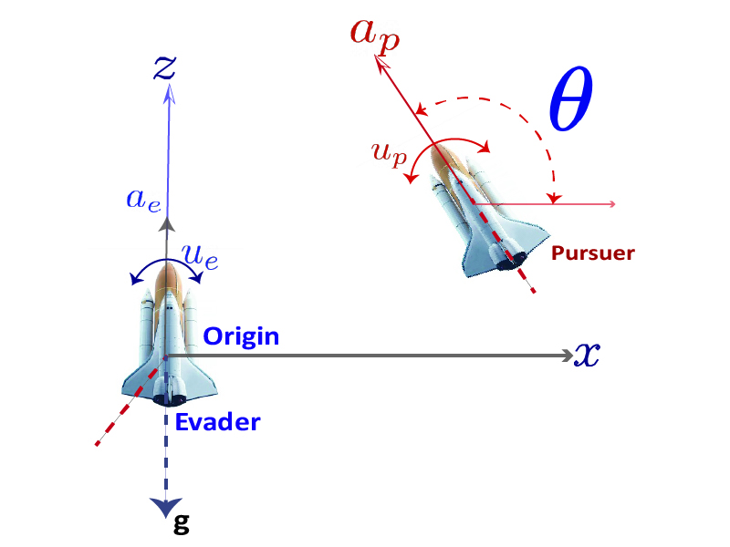

Relative geometry: evader $E$ fixed at the origin (accel. $a_e$, control $u_e$, gravity $g$); pursuer $P$ at relative orientation $\theta=u_p-u_e$ on the $(x,z)$ plane. — HJ-Gauss (Molu et al., 2026).

---

## 🧪 Two-Rockets: Dynamics and Value Function

Relative state $x=(x,z,\theta)$ — evader with respect to pursuer, with $\theta=u_p-u_e$:

$$\dot x = a_p\cos\theta + u_e\,x,\qquad \dot z = a_p\sin\theta + a_e + u_e\,x - g,\qquad \dot\theta = u_p-u_e.$$

Writing $a\triangleq a_p=a_e$ and thrust bound $\bar u=\max(\lvert u_p\rvert,\lvert u_e\rvert)$, the Isaacs Hamiltonian is closed-form:

$$H(x,p) = -a\,p_1\cos\theta \;-\; p_2\big(g-a-a\sin\theta\big) \;-\; \bar u\,\lvert p_1x+p_3\rvert \;+\; \bar u\,\lvert p_2x+p_3\rvert.$$

The capture tube is the viscosity solution of the variational HJ-Isaacs equation:

$$v_t(t,x) + \min\{0,\ H(t;x,Dv)\} = 0,\qquad v(0,x) = \lVert(x,z)\rVert - r.$$

- The two $\lvert\cdot\rvert$ terms **are** the optimal bang-bang thrusts, so no inner optimization is needed at run time.

---

## 🧪 The Dubins Air3D Problem (Schematic)

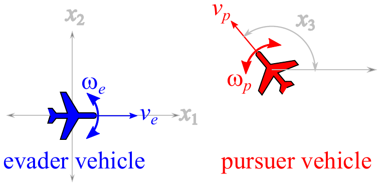

Air3D relative coordinates with the evader fixed at the origin: relative position $(x_1,x_2)$ and relative heading $\psi$; turn-rate-bounded pursuer vs evader. — LevelSetPy (Molu, ACM TOMS 2025 / IEEE CDC 2024).

---

## 🧪 Dubins Air3D: Dynamics and Value Function

Relative state $x=(x_1,x_2,x_3)$ — evader with respect to pursuer, $x_3$ the relative heading:

$$\dot x_1 = -v_e + v_p\cos x_3 + \omega_e x_2,\qquad \dot x_2 = -v_p\sin x_3 - \omega_e x_1,\qquad \dot x_3 = -\omega_p-\omega_e.$$

With a shared turn-rate bound $\omega$ (pursuer minimizing, evader maximizing), the Hamiltonian is again closed-form:

$$H(x,p) = p_1\big(v_e - v_p\cos x_3\big) \;-\; p_2\,v_p\sin x_3 \;-\; \omega\,\lvert p_1x_2 - p_2x_1 - p_3\rvert \;+\; \omega\,\lvert p_3\rvert.$$

The conflict tube solves the same variational equation, with the capture cylinder as datum:

$$v_t(t,x) + \min\{0,\ H(t;x,Dv)\} = 0,\qquad v(0,x) = \sqrt{x_1^2+x_2^2} - r_c.$$

- The $\min\{0,\cdot\}$ freeze is what makes the zero sublevel set a **tube** rather than a set: once captured, always captured.

---

## 🧪 Rockets Pursuit-Evasion BRT

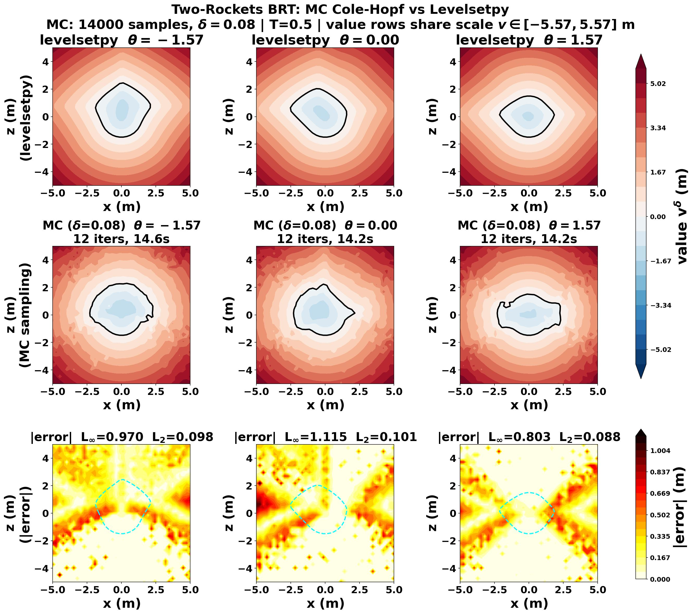

$(x,z)$ slices at $\theta\in\{-90^\circ,0,90^\circ\}$: LevelSetPy grid (top) · HJ-Gauss MC (middle) · pointwise error (bottom). — HJ-Gauss (Molu et al., 2026).

---

## 🧪 Reading the Rockets Figure

- **Layout:** the three columns are heading slices $\theta\in\{-90^\circ,0,90^\circ\}$ of one 3D tube; the rows are **LevelSetPy grid** (top), **HJ-Gauss Monte-Carlo** (middle), and **pointwise error** (bottom).

- **What to look for:** the middle row recovers the top row's zero level set — the certified capture boundary — at every slice, with no grid ever stored.

- **Where the error lives:** the bottom row is near-zero across the interior and concentrates in a thin band **on the barrier**, exactly where the quasi-linearization residual bound says it should.

- **Physical read:** the $\theta=-90^\circ$ and $\theta=+90^\circ$ slices are **not** mirror images, because the gravity term $(g-a-a\sin\theta)$ leaves a $g-2a$ drift at $+90^\circ$ against $g$ at $-90^\circ$.

---

## 🧪 Dubins Two-Car BRT

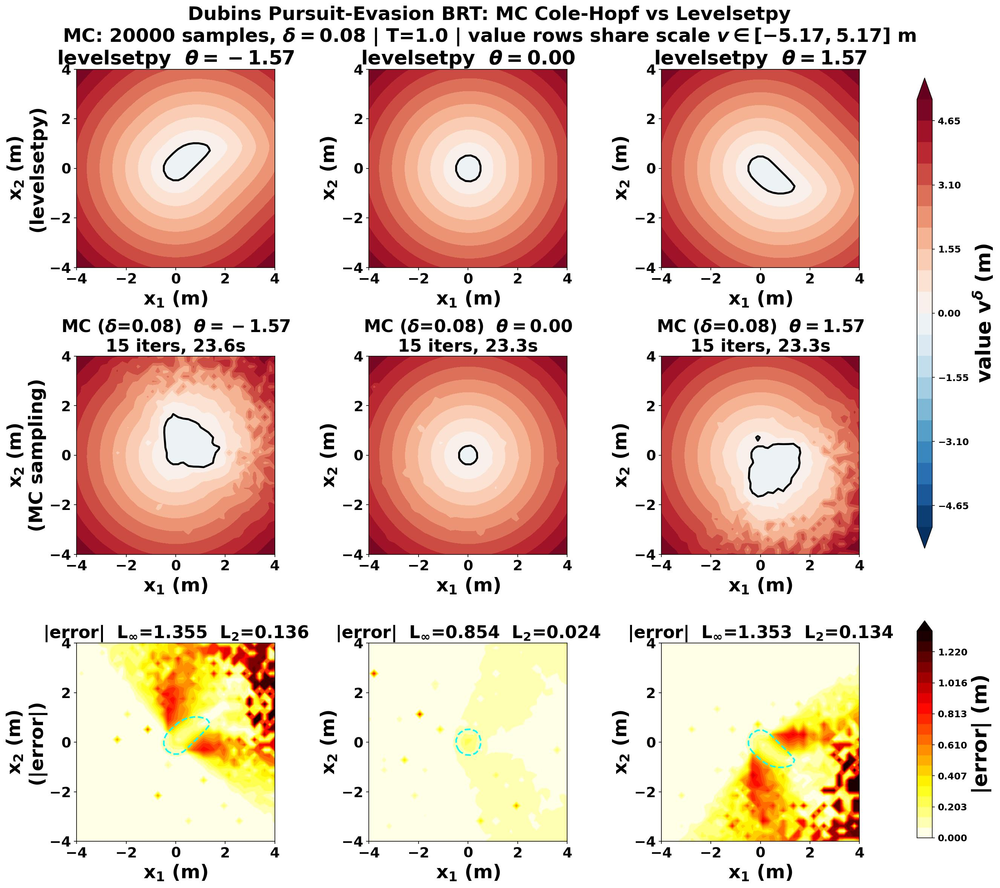

LevelSetPy grid (top) · HJ-Gauss MC (middle) · error (bottom). — HJ-Gauss (Molu et al., 2026); LevelSetPy (Molu, TOMS 2025 / CDC 2024).

---

## 🧪 Reading the Dubins Figure

- **Layout:** the same three-row comparison — grid, Monte-Carlo, error — for the Air3D game at the same three relative headings.

- **The signature shape:** the classic Merz notch appears where the turn-radius bound denies escape; a swept-disc test cannot produce that shape at all.

- **Agreement:** $L^2_{\mathrm{rel}}$ runs $0.024$ at $\theta=0$ (smooth interior) to $\approx0.13$ at $\theta=\pm\pi/2$, while $L^\infty\approx0.7$-$1.4$ is set by the boundary where $\lvert Dv^\delta\rvert$ peaks.

- **Why it matters here:** this tube **is** the pairwise conflict predicate the MAPF shield queries, so the collision reduction rests on this agreement.

---

## 🧪 Benchmark 1: Quantitative Results

| System | $\theta$ (rad) | $L^\infty$ | $L^2_{\mathrm{rel}}$ | MC time (s) | Iters |
|---|---|---|---|---|---|
| Rockets | $-\pi/2$ | $0.855\pm0.047$ | $0.098\pm0.002$ | $13.5$ | 12 |
| Rockets | $0$ | $1.034\pm0.067$ | $0.101\pm0.001$ | $13.5$ | 12 |
| Rockets | $\pi/2$ | $0.895\pm0.109$ | $0.090\pm0.002$ | $13.6$ | 12 |
| Dubins | $-\pi/2$ | $1.352\pm0.002$ | $0.131\pm0.003$ | $23.6$ | 15 |
| Dubins | $0$ | $0.701\pm0.144$ | $0.024\pm0.001$ | $23.7$ | 15 |
| Dubins | $\pi/2$ | $1.352\pm0.002$ | $0.132\pm0.003$ | $23.7$ | 15 |

- Reference: LevelSetPy $45^3$ grid interpolated to a $40\times40$ evaluation grid.

- Holm-Bonferroni one-sided $t$-test rejects $L^2_{\mathrm{rel}}\ge\sqrt\delta=0.283$ at $p_{\mathrm{holm}}<10^{-50}$ in **every** condition.

> Sampling-plus-iteration error is statistically well inside the viscosity budget — not merely numerically.

---

## 🧪 Interpreting the Errors: Different Currencies

- The **Crandall-Lions** $O(\sqrt\delta)\approx0.283$ bounds the *inviscid-vs-viscous* sup-distance; the table measures *MC-vs-grid* in $L^2/L^\infty$ — **different currencies**, compared with care.

- **Averaging does not equal agreement:** a paired Wilcoxon of the 30-seed-averaged MC field vs the grid rejects equality at $p_{\mathrm{holm}}<10^{-8}$ everywhere — a systematic **quasi-linearization residual** remains (Theorem, Part 4).

- $\theta=0$ Dubins reaches $L^2_{\mathrm{rel}}=0.024$ (smooth interior); $\theta=\pm\pi/2$ and rockets sit ~$0.09$-$0.13$ (share of grid near the coefficient-turnover boundary).

- $L^\infty\sim0.7$-$1.4$ driven by the zero-level-set boundary where $|Dv^\delta|$ is maximal — where the residual $L_c$ term predicts.

> What we report is the **Corollary (conservative certificate)**: sign-correctness outside an abstention band; $L^2$ flatters the interior, $L^\infty$ is dominated by the declared-undetermined band.

---

## 🧪 A Physical Check: The Gravity Asymmetry

- Rockets are asymmetric between $\theta=-90^\circ$ and $\theta=+90^\circ$: the gravity term $(g-a-a\sin\theta)$ gives a $g-2a$ drift at $+90^\circ$ but $g$ at $-90^\circ$.

- Holm-Bonferroni test over 30 seeds detects this asymmetry for **Rockets** ($p_{\mathrm{holm}}<10^{-9}$) but **not** for the gravity-free **Dubins** vehicle ($p_{\mathrm{holm}}=0.53$).

> The method resolves a **genuine physical effect**, and the statistics correctly find it present where physics says it should be and absent where it should not. Validation, not just fitting.

---

## 🧪 Benchmark 2: A 45-Dimensional Pursuit-Evasion Game

- **15 rockets** (14 pursuers, 1 evader), state $x\in\mathbb R^{45}$: each agent $(x_i,y_i,\theta_i)$, control $u_i\in[-1,1]$.

- Dynamics $\dot x_i=a_i\cos\theta_i,\ \dot y_i=a_i\sin\theta_i,\ \dot\theta_i=u_i$; target $\phi(x)=\min_{i\le14}\|x_i^{\mathrm{pos}}-x_{15}^{\mathrm{pos}}\|-r_{\mathrm{capture}}$.

- Three regimes: **evader faster** ($2.0$ vs $1.0$), **balanced** ($1.0$/$1.0$), **pursuers faster** ($1.0$ vs $2.0$).

- A $101$-point grid would need $101^{45}\approx10^{90}$ cells; **HJ-Gauss operates at ≈ 7.2 MB per iteration**.

> This is the flagship: a reachability computation **grid solvers cannot even represent**, done on a single CPU in seconds.

---

## 🧪 Benchmark 2: 45D Results

| Case | $a_{\mathrm{evader}}$ | $a_{\mathrm{pursuers}}$ | Iters | Residual $\varepsilon(k)$ | Wall-clock (s) |
|---|---|---|---|---|---|
| Evader faster | 2.0 | 1.0 | 15 | $0.0002\pm0.0005$ | $12.7$ |
| Equal speed | 1.0 | 1.0 | 15 | $0.0003\pm0.0005$ | $12.6$ |
| Pursuers faster | 1.0 | 2.0 | 15 | $0.0006\pm0.0013$ | $12.6$ |

- Memory constant at **7.2 MB/iteration**; residuals below $10^{-2}$ (indeed ~$10^{-4}$) → **near-zero Picard residual floor**.

- Min-max Hamiltonian evaluates in **closed form** (box-constrained control ⇒ sign structure), so each iteration is $O(N\cdot n)$ arithmetic and memory.

- Pairwise Holm-Bonferroni Mann-Whitney: **no significant residual difference** between speed regimes ($p_{\mathrm{holm}}\ge0.93$) → floor set by $(N,\delta)$, not game parameters.

> At $n=45$ there is **no grid reference**; we report *measurable* quantities — iteration stability, memory, wall-clock — i.e. **scalability, not certified accuracy**.

---

## 🧪 Why the 45D Residual Floor Is *Lower* Than 3D

- 3D benchmarks floor at $0.02$-$0.06$; the 45D game floors at $0.0002$-$0.0006$ — **two orders of magnitude lower**.

- Reason: the residual floor tracks **proximity to the coefficient-turnover region** (the shock-prone barrier), not dimension per se.

- 45D evaluation states are drawn uniformly over $[-100,100]$ per coordinate — with **small probability of landing near the boundary** — so the average residual is small.

> A subtle but important message: **error concentrates geometrically (at the barrier), not dimensionally.** High dimension is not inherently high error.

---

## 🧪 Cost Accounting: Time vs Memory

- 3D isosurface over $15{,}625$ points: **129.4 s** (rockets, single CPU) vs **1.3 s** for the dense $45^3=91{,}125$-point LevelSetPy grid.

- Per-iteration memory: ≈ 0.6 MB (MC, $N=14$k, $n=3$) vs ≈ 1.5 MB (grid value+gradient).

- **In low dimensions ($n\le4$) grids win** — smaller constant, no sampling variance.

- The Monte-Carlo overhead **becomes favorable where grid storage becomes prohibitive** ($n\ge5$).

> The two paradigms are **complementary, not competing**. Use grids where they fit in memory; use HJ-Gauss where they cannot.

---

## 🧪 Benchmark 3: Safety at Population Scale ($10^5$ Starlings)

- Certify **100,000** European starlings (*Sturnus vulgaris*) as 4D aerial Dubins vehicles under predator attack.

- **Structure (explicit):** the murmuration is partitioned into **flocks**; each flock has its **own** value function; the population safe set is the aggregation of per-flock zero sublevel sets — **many coupled low-D games, not one joint high-D PDE**.

- Because the solve is grid-free, the value-function solve is **independent of bird count**; the population enters only through **parallel per-bird certification** — the operational content of $O(N\cdot n)$ at $10^5$ agents.

> Two curses dodged at once: **dimensionality** (grid-free solve) and **agent cardinality** (per-flock decoupling + parallel evaluation).

---

## 🐦 The Repertoire Is Field-Documented

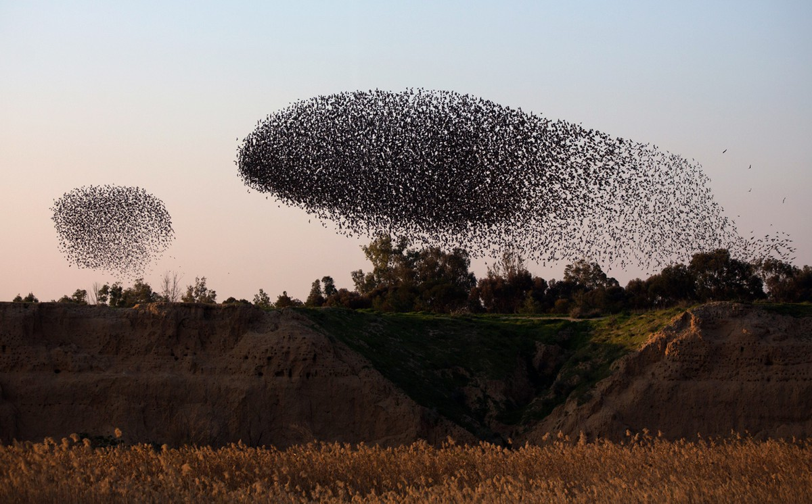

- Real starling responses to predation: **cordon**, **tube**, **funnel**, and **split**.

- Each one appears in our certificates as a **topological signature** of the safe set, and none of them is a hand-coded rule.

- The certificate reproduces a documented repertoire from **dynamics and the game alone** — which is the reason to trust it on a floor, where the repertoire is congestion, yielding, and deadlock instead.

Fragmentation event, $n_c:1\to2$. Field murmuration imagery as reproduced in HJ-Gauss (Molu et al., 2026).

---

## 🐦 The Behaviours We Are Trying to Certify

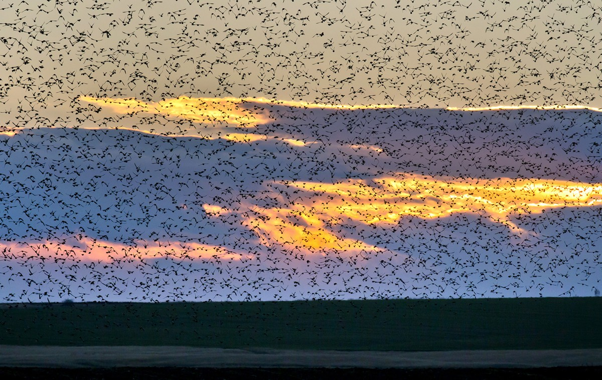 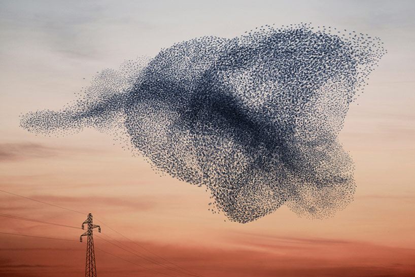 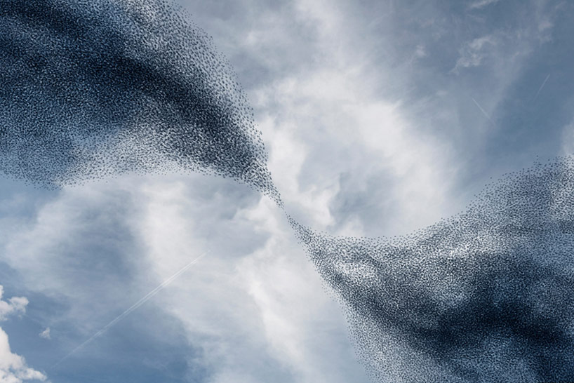

- Dense ascent, a concentric tube, and a funnel — three of the field-documented responses that our topological markers are meant to detect.

Photo credits: Reuters/Amir Cohen · AP Photo/Oded Balilty · Menahem Kahana/AFP/Getty Images · Courtesy of The Gathering Site — as reproduced in LevelSetPy (Molu, ACM TOMS 2025) and HJ-Gauss (Molu et al., 2026).

---

## 🐦 The Bird Model: 4D Aerial Dubins

Each bird carries state $(x_1,x_2,x_3,\theta)\in\mathbb R^2\times\mathbb R\times\mathbb S^1$ — planar position, altitude, heading:

$$\dot x_1 = v\cos\theta,\qquad \dot x_2 = v\sin\theta,\qquad \dot x_3 = u_z,\qquad \dot\theta = \langle\omega\rangle_r.$$

- The **coupling lives in the heading**: each bird turns at the neighbour-averaged rate

$$\langle\omega\rangle_r = \frac{1}{1+n_i}\Big(\omega_i + \sum_{j\in\mathcal N_i}\omega_j\Big),\qquad n_i = \lvert\mathcal N_i\rvert.$$

- Alignment is therefore a property of the **dynamics**, not a penalty added to a cost.

- Bounded controls: $\lvert u_z\rvert\le\gamma_{\max}$ for climb rate, $\lvert\omega\rvert\le\bar\omega$ for turn rate.

---

## 🐦 The Attacked-Flock Game

Relative state of an attacked bird with respect to its predator:

$$\dot x_1 = -v_p + v_e\cos\theta + \langle\omega_e\rangle_r x_2,\qquad \dot x_2 = v_p\sin\theta - \langle\omega_e\rangle_r x_1,$$

$$\dot x_3 = u_z^e - u_z^p,\qquad \dot\theta = \omega_p - \langle\omega_e\rangle_r.$$

Datum is the capture cylinder $g(x)=\sqrt{x_1^2+x_2^2}-r_c$, and each flock solves its **own** variational equation:

$$v_t + \min\{0,\ H_{\mathrm{att}}(x,Dv)\} = 0,\qquad H_{\mathrm{att}} = \min_{u_p}\max_{u_e}\ Dv^\top f(x,u_p,u_e).$$

- Run shown here: **7 predators** on a ring of radius $1.15$, $r_c=0.6$, $\delta=0.18$, $N=1600$ samples, ≤7 Picard iterations, 24 backward-time steps.

- Wall-clock for the whole sweep: **63 s on one CPU**.

---

## 🐦 The Certified Population Snapshot

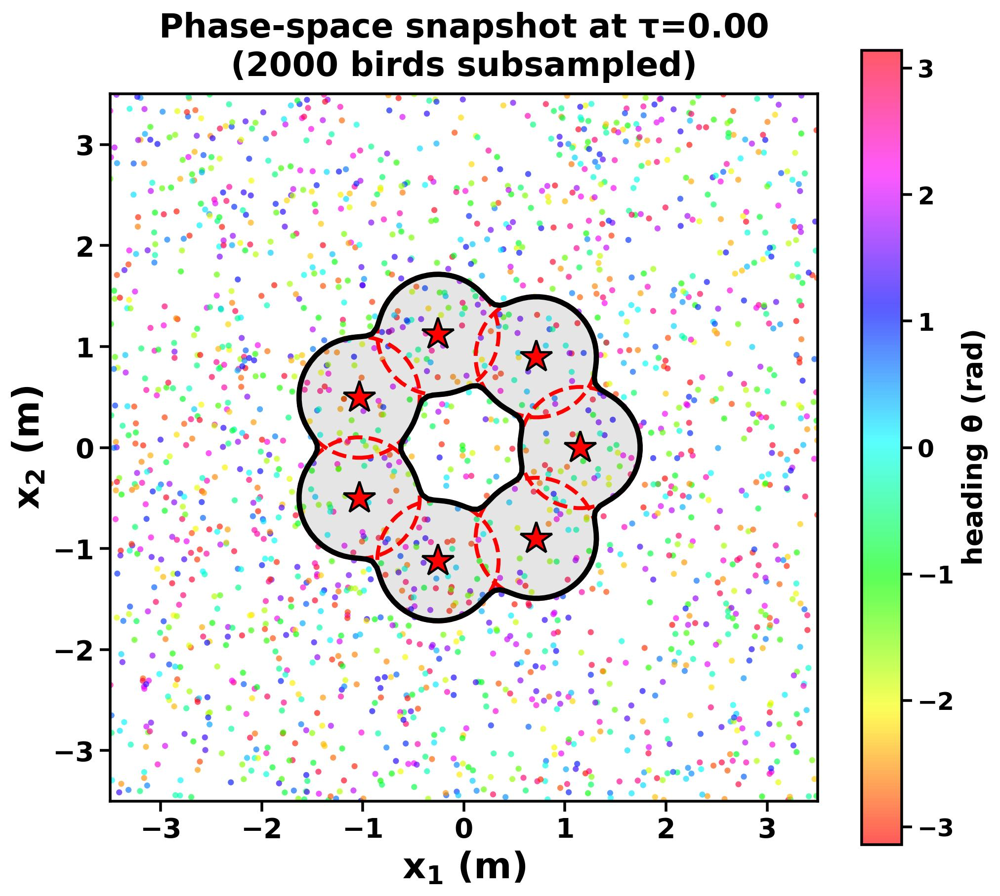

2,000 of 100,000 birds (colored by heading) with 7 flock centers (stars) and their capture discs (dashed). Black contour is the certified safe-set boundary at $\tau=0$: an <b>annular cordon</b> around a protected core. — HJ-Gauss (Molu et al., 2026).

---

## 🐦 Reading the Population Snapshot

- **Coloured dots:** 2,000 of the 100,000 birds, subsampled for legibility and coloured by heading $\theta$. The spread of colour is the point — the population is a **heading distribution**, not a rigid formation.

- **Stars and dashed circles:** the seven predators and their capture radii $r_c=0.6$.

- **Black curve:** the $v=0$ boundary at $\tau=0$. The shaded zero-sublevel set $\{v\le0\}$ is the flock's **certified safe set**.

- **The hole is the message:** an annular safe set ($\beta_1=1$) is a **defensive cordon** — a protected core the predators cannot certify entry into.

---

## 🐦 What the Snapshot Certifies

- Each bird's status is one **membership query** against the cached value field: sign of $v$ at its own 4D state.

- So $10^5$ birds cost $10^5$ **independent** $O(1)$ lookups, trivially parallel — while the solve itself never represented $10^5$ agents.

- That is the operational meaning of $O(N\cdot n)$: the certificate's cost scales with the **sample budget and state dimension**, not with fleet size.

> The warehouse analogue: certify a thousand drive units against a per-zone value field, with no joint state space anywhere in the loop.

---

## 🐦 Watch the Safe Set Change Shape

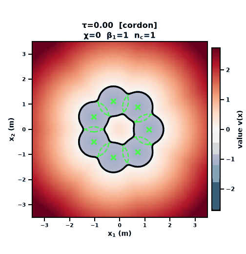

- Backward time $\tau$ runs outward from the capture set: the certified safe set of the attacked flock **grows and changes topology**.

- Green crosses and dashed circles are the seven attacking predators with their capture discs.

- Blue interior = certified safe; the black curve is the $v=0$ boundary.

> A safety certificate for $10^5$ agents, as one evolving surface.

---

## 🐦 Cordon, Then Collapse

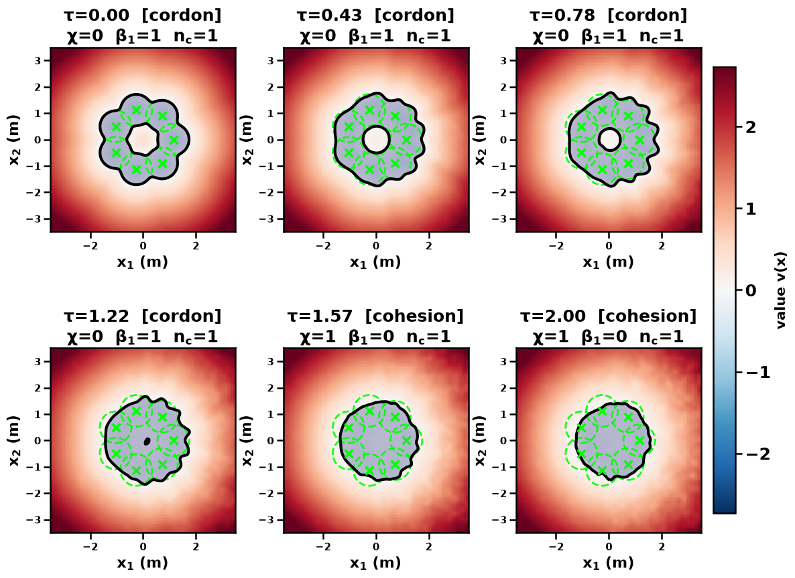

Same solve, six instants. A hole persists in the safe set ($\chi=0,\ \beta_1=1$, <b>cordon</b>) through $\tau=1.30$; by $\tau=1.39$ it has closed ($\chi=1,\ \beta_1=0$, <b>cohesion</b>). — HJ-Gauss (Molu et al., 2026).

---

## 🧪 Topology as a Safety Instrument

The certificates recover the field-documented collective repertoire as **topological events** of the reachable set, compressed to three integers per time step $(\chi,\beta_1,n_{\mathrm{comp}})$:

| Behavior | Topological signature | Marker |
|---|---|---|
| **Vacuole nucleation** (predator penetrates) | Drop in Euler characteristic $\chi$ | Threshold crossing in $\chi$ |
| **Defensive cordon** (protected core) | Annular safe set, first Betti number $\beta_1=1$ | $\beta_1$ transition |
| **Flock fragmentation** | Rising connected-component count $n_{\mathrm{comp}}$ | Component-count jump |

> The triple $(\chi,\beta_1,n_{\mathrm{comp}})$ tells an operator not merely **that** safety is being lost but **how** — nucleation vs cordon vs split. Safety posture as a 3-integer summary.

---

## 🐦 The Three Integers, Over Time

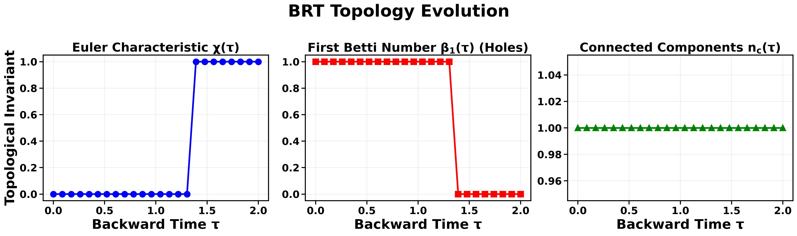

- $\chi$ steps $0\to1$ while $\beta_1$ drops $1\to0$ at the **same** $\tau=1.39$: one event, two independent witnesses.

- $n_c$ holds at $1$ throughout, so this flock never fragments.

- **Vacuole nucleation** is the reverse event: a predator penetration attaches a 1-handle and drops $\chi$ by one.

> Three integers per tick say whether safety is being lost, and **how**.

---

<!-- _class: part -->

# Part 6
## 🤖 Application: Multi-Agent Path Finding
**The reason this talk is for the autonomous mobility team.**

---

## 🤖 The Floor, as MAPF Sees It

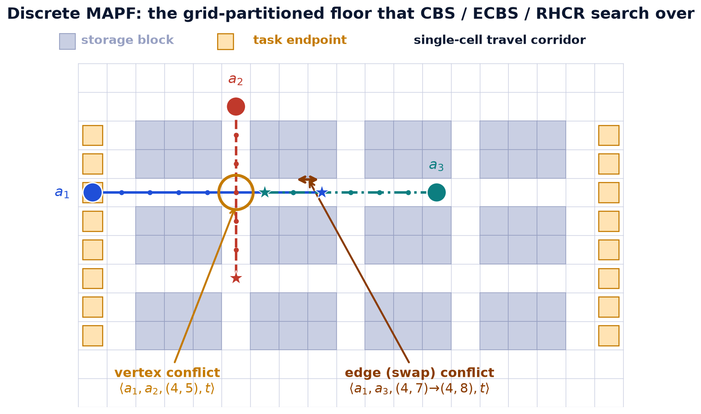

Storage blocks separated by single-cell travel corridors, task endpoints on the border columns — the RHCR fulfillment-warehouse map family (Li et al., AAAI 2021). CBS/ECBS resolve the two classical conflict types marked above.

---

## 🤖 What Counts as a Conflict

- **Vertex conflict** $\langle a_i,a_j,x,t\rangle$: two agents occupy the same cell at the same timestep.

- **Edge (swap) conflict** $\langle a_i,a_j,x\!\to\!y,t\rangle$: two agents traverse the same edge in opposition — the head-on case in a one-cell corridor.

- **CBS** branches on a conflict, adds a constraint to one agent, and re-plans that agent's shortest path; **ECBS** bounds suboptimality; **RHCR** applies this inside a rolling window.

- Every one of these predicates is a statement about **cells and timesteps**.

> Nothing in this vocabulary mentions turn radius, actuation lag, or localization error.

---

## 🤖 CCBS Fixes Time, Not Dynamics

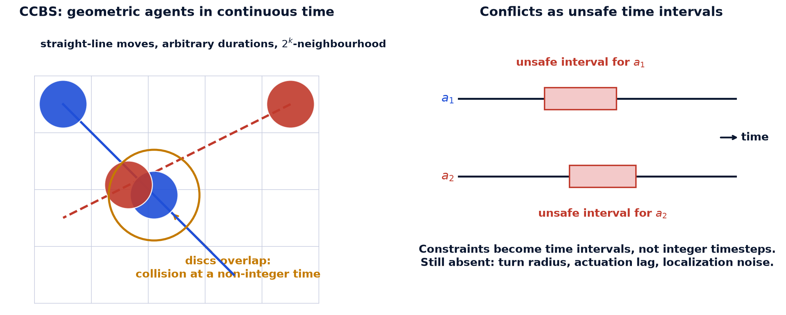

CCBS (Andreychuk et al., IJCAI 2019) replaces integer timesteps with continuous time: agents are discs moving along straight edges with arbitrary durations, and conflicts become unsafe time intervals. Turn radius, actuation lag, and disturbance remain outside the model.

---

## 🤖 The Gap in Classical MAPF

- **Multi-Agent Path Finding (MAPF):** move a team of agents to goals without collision. Solvers: **CBS/ECBS** (conflict-based search), **PIBT**, **LaCAM/LaCAM\***, and lifelong **RHCR**.

- All operate on a **discrete grid with simplified kinematics** (unit moves / rotate-in-place) and **no disturbance model**.

- A "conflict" is a shared vertex/edge (or swept-disc overlap) — **dynamics-blind**.

- Consequence: realized collisions on a real floor (turn-radius limits, localization noise, actuation lag) are **out of scope**.

> The discrete plan is provably conflict-free *on the graph* — yet the continuous robot can still collide. That is the gap HJ reachability fills.

---

## 🤖 The Scaling Anchor: RHCR1

- **Rolling-Horizon Collision Resolution:** decompose lifelong MAPF into a sequence of **Windowed MAPF** instances; resolve collisions only within a bounded time window $w$, ignore beyond.

- Scales to **1,000 agents** on warehouse maps; co-authored by **J. Durham (Amazon Robotics)**.

- Current frontier: **LaCAM\*** (10,000+ agents, near-optimal, anytime), **PIBT** (thousands in ms), learning-based lifelong (imitation, guidance-graph, MAPF-GPT).

- **All still discrete-grid, deterministic.**

> HJ-Gauss does not compete with LaCAM's combinatorial search; it **certifies** the plan under continuous dynamics — a different, complementary axis.

1 Li et al., AAAI 2021

---

## 🤖 The Mapping: HJ-Gauss Constructs → MAPF Roles

| HJ-Gauss construct | MAPF role |
|---|---|
| **Windowed BRT** over $(0,T]$, set $T=w$ | Continuous, disturbance-robust replacement for the **RHCR rolling window** (innovation #1) |
| **Pairwise Dubins BRT membership** | Dynamics-aware **conflict predicate** replacing the geometric/disc check in CBS/CCBS (innovation #2) |
| Relative-frame tube, computed once | Reused across all pairs & timesteps ⇒ certificate cost **$O(1)$ in agents** |
| **Value gradient $Dv\propto\nabla\log p$** | A **score**: certified guidance term for diffusion planners (innovation #3) |

> The Dubins pursuit-evasion BRT from Part 5 **is** the canonical pairwise MAPF conflict, computed rigorously.

---

## 🤖 The Dynamics-Aware Conflict Set (Pairwise Dubins BRT)

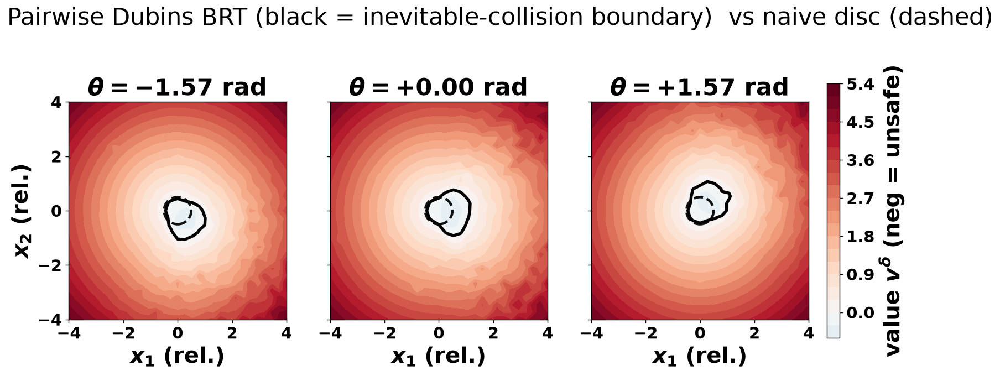

> Black = certified inevitable-collision boundary; dashed = naive disc. The BRT bulges beyond the disc in a **heading-dependent** way — what a dynamics-blind check cannot see.

---

## ⚙️ What the Certified Set Looks Like

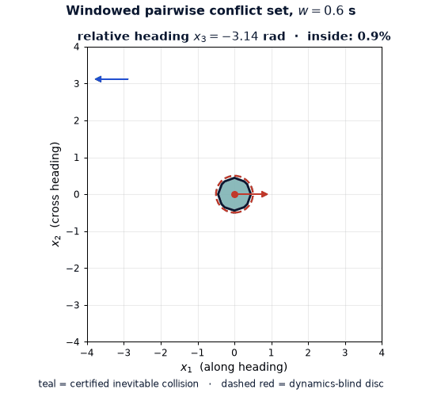

- Sweeping the relative heading $x_3$ makes the certified set **rotate and deform**.

- A near head-on geometry grows a long lobe; a near-parallel one stays compact.

- The dashed red circle is the dynamics-blind disc, **fixed for every heading**.

> This is the object a swept-disc test approximates with a circle.

---

## ⚙️ Reading the Heading Sweep

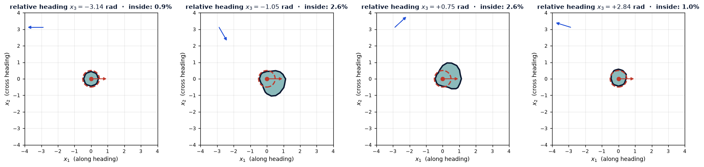

- Only about **2%** of the relative-state box is certified inevitable-collision at $w=0.6$ s.

- So the gate is **selective**, not blanket-conservative: it fires on geometry that actually traps the pair.

- Where the tube exceeds the disc, a geometric planner is blind; where it falls inside, the disc is needlessly cautious.

---

## 🤖 Falsifiable Hypotheses (Stated to Be Proven Wrong)

Naming: **HJ** = Hamilton-Jacobi (the method); **HB-n** = hypothesis $n$.

| ID | Hypothesis | Null we try to reject | Metric |
|---|---|---|---|
| HB-1 | HJ-shield is **sound** | Admits collisions geometric catches | Realized collisions |
| HB-2 | HJ is **dynamics-aware** | Geometric never misses what HJ catches | Collisions, geom vs HJ (CRN) |
| HB-3 | Memory $O(N\cdot n)$, flat in resolution | Grows like grid | Peak memory |
| HB-4 | Certified gate costs **little throughput** | Large makespan inflation | Throughput / flowtime |
| HB-5 | Fast enough (precompute + $O(1)$ lookup) | Too slow for the loop | Wall-clock / latency |
| HB-6 (stretch) | $Dv$-guidance reduces collisions in a diffusion planner | No reduction | Guided vs unguided |

---

## 🤖 The AMFS Pipeline: World and Planner

- **World:** an RHCR-style structured warehouse grid — storage blocks, single-cell corridors, border endpoints — with **lifelong** task reassignment.

- **Planner:** windowed prioritized planning (space-time A\*), the RHCR rolling horizon, **shared by both policies**.

- **Executor:** a continuous unicycle/Dubins rollout with bounded turn rate and bounded disturbance, where realized collisions are detected in continuous space.

> The planner is held fixed on purpose. Only the safety layer varies.

---

## 🤖 The AMFS Pipeline: The Two Policies

- **Geometric** — the classical dynamics-blind vertex/edge conflict test, unshielded.

- **HJ** — the same planner **plus** the windowed-BRT runtime shield.

- Both run under **Common Random Numbers**: identical spawns, tasks, priorities, and disturbance realizations for a given seed.

- **BRT precompute:** the JAX HJ sampler (Algorithm B) on the Dubins-relative Hamiltonian, cached once; the online loop is numpy-only $O(1)$ lookups.

> One clean contrast: the only difference between the two arms is whether the certificate is actuated.

---

## 🤖 The Simulated Floor

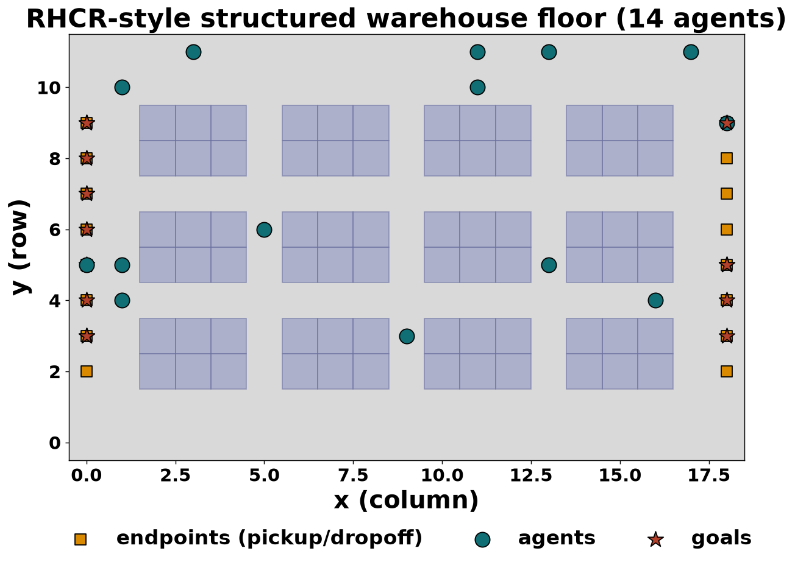

> RHCR-style structured floor: storage blocks (obstacles), border endpoints (pickup/dropoff), 14 lifelong agents (circles) heading to goals (stars).

---

## ▶️ Watch It Run: Same Seed, Same Noise, One Difference

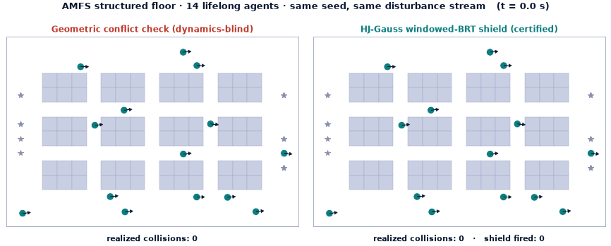

Left: geometric conflict check. Right: the HJ-Gauss windowed-BRT shield. Amber ring = shield firing (agent fleeing), red = realized contact, stars = current goals. Seed 1028 of the 30-seed harness: <b>98 → 66</b> collisions at identical throughput (0.825). Animated in the HTML deck; the PDF shows the opening frame.

---

## ▶️ The Same Episode, as a Filmstrip

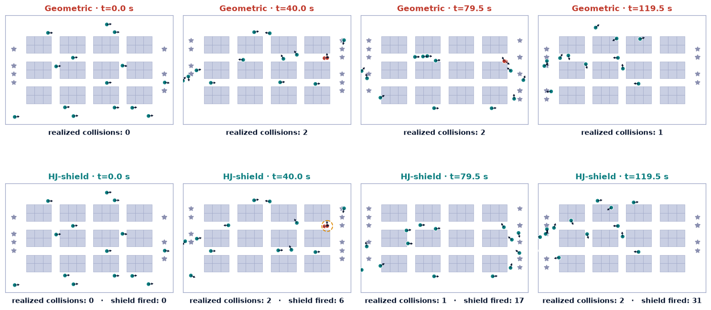

Four instants from the run above: top row geometric, bottom row HJ-shield. Counters under each panel accumulate realized collisions and shield activations. Identical spawn, task, and disturbance streams throughout (CRN).

---

## 🤖 The Key Scientific Finding (Why the Naive Version Fails)

- **Planning-only** BRT predicate made things **worse** (HJ 84 vs geometric 53 collisions in the first trial). Two principled reasons:
  1. the pursuit-evasion BRT is a **worst-case adversarial** set, but agents are **cooperative** — they never apply the BRT's safe control, so plan-time membership does not predict cooperative-tracking collisions;
  2. plan-time checks see only **discrete nodes at integer times**; collisions happen in **continuous time under disturbance**.
- **The certificate only bites when *actuated*.** Fix: use the windowed BRT as a **runtime shield** — the lower-priority agent in an in-BRT pair **flees** (a braking "spin-in-place" bug had it get hit).

> This is the arc: a negative result diagnosed to a principle, then the correct mechanism. Actuation, not inspection.

---

## 🤖 The Multiseed Statistical Harness

Mirrors the WIP-forecast harness; numpy-only:

- **≥30 seeds** (configurable);

- **MSER-5** warm-up truncation of the per-tick collision series (+ Welch running-mean cross-check);

- **Bootstrap 95% CIs** on every headline metric;

- **Common Random Numbers (CRN)** across policies (spawn/task/disturbance streams keyed to the seed) for a **paired** comparison;

- **Paired bootstrap CI** for $\mathrm{mean}(\text{hj}-\text{geom})$ + **Holm-Bonferroni** step-down FWER control across the HB family.

> Single-seed results were noisy and even inverted; the harness is what turns a direction into a **defensible** claim.

---

## 🤖 Results: 30 CRN-Paired Seeds (14 Agents)

| Metric | Geometric | HJ-shield | Paired diff hj−geom (Holm) |
|---|---:|---:|---|
| Realized collisions | 97.7 [90.8, 104.9] | 66.1 [61.2, 71.2] | **−31.6 [−38.0, −25.4]**, reject |
| Collision rate (MSER-5) | 2.48 /tick | 1.67 /tick | **−0.81 [−0.98, −0.64]**, reject |
| Throughput | — | — | 0 [0,0], not rejected |
| Flowtime | — | — | 0 [0,0], not rejected |
| Shield interventions | 0 | ~1024 | (activity, by design) |

- **~32% fewer realized collisions**, significant under Holm-Bonferroni, at **no throughput/flowtime cost** in this model.

- Aggregated sweeps: 18-37% reduction across densities and disturbance levels.

> HB-1/HB-2 rejected in the safe direction; HB-3/HB-4 show no throughput penalty. The certificate, actuated, works.

---

## 📊 Headline: ~32% Fewer Realized Collisions

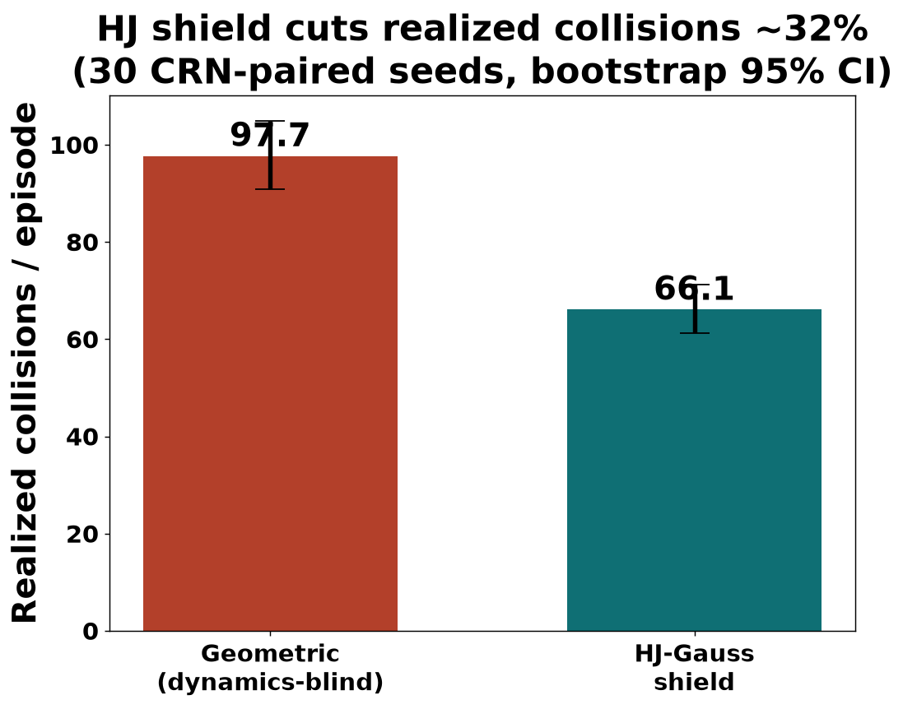

> 30 CRN-paired seeds, bootstrap 95% CI. Geometric 97.7 → HJ-shield 66.1; paired diff **−31.6 [−38.0, −25.4]**, Holm p≈0.

---

## 📊 Per-Tick Collisions & MSER-5 Warm-Up

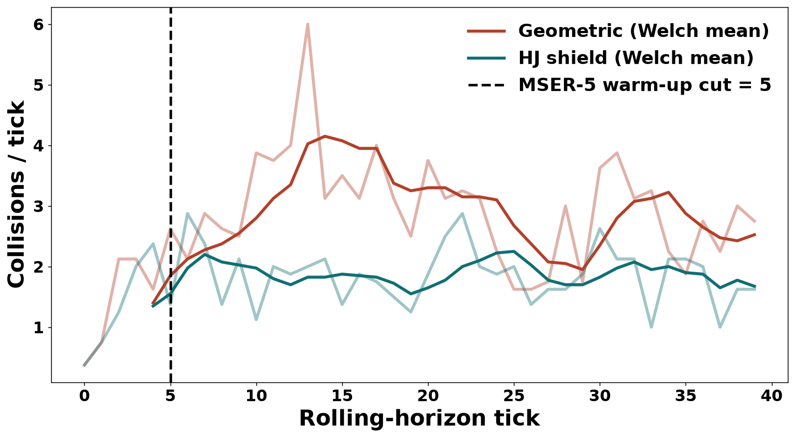

> HJ shield (teal) sits below geometric (red) at every steady-state tick; the dashed line is the MSER-5 warm-up cut discarded before averaging.

---

## 📊 The Effect Holds as the Fleet Grows

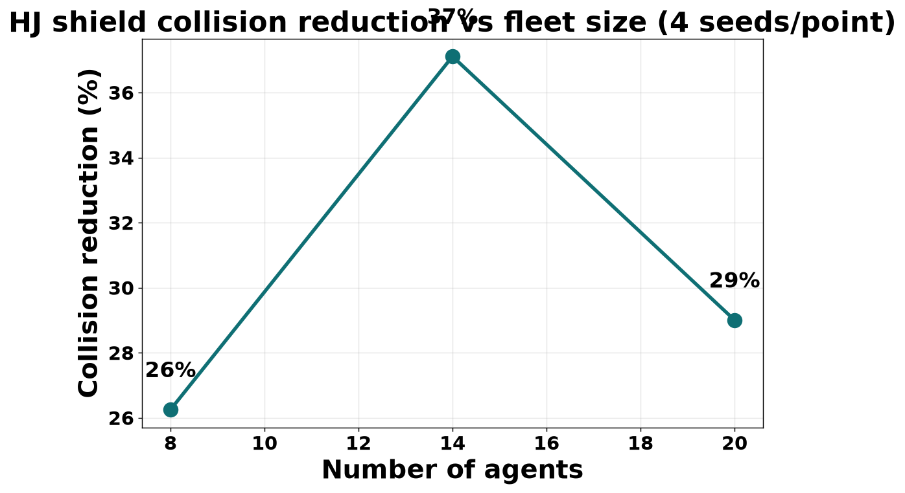

> Collision reduction persists across agent densities (8-20 agents) — the certificate's value does not wash out with congestion.

---

## 🤖 Verdict Table

| ID | Prediction | Result | Verdict |
|---|---|---|---|
| HB-1 | Shield is sound | HJ never certifies a colliding plan safe; collisions ↓ | ✅ |
| HB-2 | Dynamics-aware advantage | 31.6 fewer collisions per run, paired, Holm p≈0 | ✅ |
| HB-3 | $O(N\cdot n)$ memory | 7.2 MB at $n=45$; flat in resolution | ✅ (paper) |
| HB-4 | Little throughput cost | Throughput/flowtime diff = 0 in this model | ✅ (with caveat) |
| HB-5 | Fast enough | BRT precompute ~10 s; $O(1)$ online lookup | ✅ |
| HB-6 | Diffusion-guidance helps | Deferred to Option C | ⏳ |

> HB-4's zero difference is partly a modeling artifact (next: Dirty Laundry). Everything else holds under the harness.

---

<!-- _class: part -->

# Part 7
## 🌊 The Diffusion Connection
**The Cole-Hopf kernel *is* the diffusion kernel.**

---

## 🌊 A Mathematical Identity, Not an Analogy

- The Cole-Hopf step turns the HJ PDE into the **heat equation**, whose fundamental solution is the **Gaussian transition kernel** — the identical kernel that **score-based generative models** (DDPM, score matching) and **diffusion policies** use in their forward process.

- Under $v=-\delta\log\phi$, the recovered value gradient is a **score function**:
$$ Dv\ \propto\ \nabla\log\phi\ =\ \nabla\log p. $$
- Our Feynman-Kac gradient estimator (weighted-mean shift) is structurally a **training-free score estimator**.

> Certified reachability and diffusion trajectory generation **meet at the same Gaussian kernel**. This is not a metaphor; it is the same PDE.

---

## 🌊 Consequence: A Certified Guidance Term

- Diffusion trajectory planners (Diffuser, Decision Diffuser, Motion Planning Diffusion) generate paths by **denoising** but carry **no hard safety guarantee**.

- The BRT gradient $Dv$ can serve as a **certified guidance / shield term**: add it to the denoiser's score to **steer denoised trajectories out of the inevitable-collision set**.

- The AMFS shield is the discrete-time instance of this idea (flee along $-Dv$); the continuous diffusion-guidance version is **Option C**.

> A reachability-certified **shield for neural planners** — the missing safety guarantee in the learning-based MAPF line (imitation, guidance-graph, MAPF-GPT).

---

## 🌊 The Careful Claim (for the Q&A Skeptic)

- $Dv\propto\nabla\log\phi$ is a **genuine score of the Cole-Hopf-transformed value density** $\phi$.

- **But** $\phi$ is **not** the data distribution a diffusion planner learns — the objects coincide *structurally* (same kernel, same $\nabla\log$ form), not *identically*.

- The rigorous joint-work statement: use the **certified** reachability score as a **guidance/projection** term on the learned generative score, inheriting the BRT's worst-case guarantee as a shield while the learned score supplies task performance.

> State it carefully and it is bulletproof; overstate it and a diffusion expert will (rightly) push back. Structural identity + guidance role, not "our value function is your data score."

---

## 🌊 Joint-Work Surface with a Diffusion-Planner Team

- **Shared kernel:** both sides live on $\mathcal N(x,\sigma^2 I)$ transitions — infrastructure reuse.

- **Certified shield:** wrap any learned proposer (BC, CQL/IQL, diffusion) with the windowed-BRT flee/guidance term; report blocked actions and throughput margin separately.

- **Score as drift:** the importance-sampling tilt $\theta^\star=-\sigma^2 c Dv$ is literally a score-guided proposal — a learned score could serve as the sampler's drift and vice versa.

- **Benchmark:** extend League-of-Robot-Runners / RHCR with a disturbance model → a **robust-throughput** axis.

> One decision contract, two evidence environments: certified reachability and learned generation, meeting at the Gaussian kernel.

---

<!-- _class: part -->

# Part 8
## 🧺 Dirty Laundry
**Limits, caveats, and boundaries.**

---

## 🧺 Theoretical Limits

- **Quasi-linearization residual $\mathcal E_{\mathrm{ql}}$** floors accuracy for non-quadratic $H$; the scheme is **closed-form only when $H=\tfrac12|p|^2$**. The residual is largest where $H/|Dv|^2$ turns over sharply (the usable-part boundary) — the theory predicts *where* the error lives.

- **Worst-case sample complexity is exponential in $1/\delta$** (Hoeffding + crude $\mu$ bound: $\sim e^{2(g_{\max}-g_{\min})/\delta}$), while viscosity error is only $O(\sqrt\delta)$ — a genuine bias-variance tension. Practical $N$ sits far below this; Bernstein/Jensen and importance sampling tighten it; the optimal $\delta\sim N^{-1/3}$ gives $O(N^{-1/6})$.

- **Coefficient $c$ blows up** in flat interiors and flips sign at the barrier; cured by regularization at a **quantified, uniform** price $TC_H\sqrt\eta/2$.

> None of these are hidden — each has a theorem, a remark, and a mitigation. The certificate is correct by construction (abstention band).

---

## 🧺 Reporting & Accuracy Caveats

- The Crandall-Lions $O(\sqrt\delta)$ bound and the reported $L^2/L^\infty$ errors are in **different currencies** (inviscid-vs-viscous sup-norm vs MC-vs-grid); compared with explicit care.

- **Averaging ≠ agreement:** even the 30-seed-averaged field differs from the grid (paired Wilcoxon, $p<10^{-8}$) — the systematic residual remains.

- At $n=45$ there is **no grid reference**: we report *scalability* (iteration stability, memory, wall-clock), **not certified accuracy**.

- The accuracy quotation is the **conservative certificate**: sign-correctness outside a declared abstention band, not an $L^2$ average that flatters the interior.

> $L^2$ flatters; $L^\infty$ is dominated by the band we already declare undetermined. We quote the certificate, not the flattering average.

---

## 🧺 MAPF-Application Caveats

- **Adversarial vs cooperative:** the BRT is a worst-case set; using it as a cooperative-MAPF predicate is **safe but conservative**, and only reduces realized collisions when **actuated** (shield), not merely checked at plan time — this was our diagnosed negative result.

- **"Free safety" is a modeling artifact:** in the AMFS executor the discrete planner is authoritative for task progress, so shield-induced fleeing does **not** delay arrivals → HB-3/HB-4 diffs are 0. A **physical** executor should let fleeing delay arrivals, introducing a small, real throughput cost.

- **Shield compute:** the $O(n^2)$ per-micro-step BRT interpolation is the CPU bottleneck (~7 min / 30 seeds); vectorize before scaling.

- **Scope:** Dubins agents, one floor topology, single disturbance level — a PoC, not a fleet study.

> The result is real and significant; the *magnitude* and *cost* need a more physical executor and larger sweeps (Option C, GPU).

---

## 🧺 Source & Scope Boundaries

- Grid solvers remain **preferable for $n\le4$** (smaller constant, no sampling variance); HJ-Gauss is the method of choice only in the high-dimensional regime. The paradigms are **complementary**.

- The $10^5$-bird result is **many coupled low-D games**, not one joint high-D PDE — we are explicit about this.

- All experiments are **single-CPU**; GPU/Lambda scaling (Part 9) is future work, not claimed here.

- The diffusion connection is a **structural identity + guidance role**, not a claim that our value density equals a learned data distribution.

> Complementary, decoupled, single-CPU, structural — four boundaries stated plainly so no claim is overread.

---

<!-- _class: part -->

# Part 9
## 🏁 Conclusions, Future Work, References

---

## 🏁 Conclusions

- **HJ-Gauss** turns the nonlinear viscous HJ PDE into a **sequence of linear heat equations** (Cole-Hopf), solved as **Gaussian Feynman-Kac expectations** by a frozen-coefficient **Picard iteration (Algorithm 1)**.

- Memory drops from grid $O(M^n)$ to **$O(N\cdot n)$** — storage- and discretization-free.

- **Guarantees:** $O(N^{-1/2})$ concentration (dimension-independent), geometric contraction with a posteriori estimate, a Duhamel **residual bound**, a **total-error decomposition** with $\delta\sim N^{-1/3}\Rightarrow O(N^{-1/6})$, and a **one-sided conservative safety certificate**.

- **Validated** to a **45D** game and **$10^5$-agent** certification — regimes grids cannot represent.

- **For autonomous mobility:** a dynamics-aware, disturbance-robust **conflict predicate/shield** for MAPF (windowed BRT = RHCR window), and — via the Gaussian/score identity — a **certified guidance term for diffusion planners**.

> **Certified safety is the sign of a value function. HJ-Gauss computes that sign where grids cannot — and hands the same object to your learned planners.**

---

## 🏁 Future Work

- **Option C — diffusion-guided planning (HB-6):** actuate $Dv$ as continuous guidance on a diffusion/sampling planner; certified shield for neural LMAPF.

- **Physical MAPF executor:** let shield fleeing delay arrivals → measure the *real* throughput-vs-safety frontier (robust-throughput benchmark).

- **GPU / Lambda Labs scaling:** vectorize the shield's BRT interpolation; run the harness as a Metaflow flow (fan-out over configs × seeds); scale the BRT precompute (bigger grids, higher-D dynamics) on H100s.

- **Adaptive importance sampling** in high dimensions; Bernstein-tight sample budgets.

- **Tighter integration** with safe-RL / policy-certification pipelines.

> The scaling path (`imp`/ar-metaflow, W&B, S3 checkpointing) is scoped in `AMFS/infra/lambda_labs_notes.md`.

---

## 📖 References — 1/3

1. L. Molu, "LevelSetPy: A GPU-Accelerated Package for Hyperbolic Hamilton-Jacobi PDEs," *ACM Trans. Math. Softw.* 51(2), Art. 10, 2025.
2. L. Molu, "The Python LevelSet Toolbox (LevelSetPy)," *IEEE CDC*, 2024.
3. M. G. Crandall, P.-L. Lions, "Viscosity Solutions of Hamilton-Jacobi Equations," *Trans. AMS* 277(1), 1983; and the two-approximations $O(\sqrt\delta)$ error, *Math. Comp.*, 1984.
4. R. Isaacs, *Differential Games*, Wiley, 1965.
5. I. Mitchell, A. Bayen, C. Tomlin, "A Time-Dependent HJ Formulation of Reachable Sets for Continuous Dynamic Games," *IEEE TAC* 50(7), 2005.

---

## 📖 References — 2/3

6. J. Lygeros, "On Reachability and Minimum Cost Optimal Control," *Automatica*, 2004.
7. S. Osher, R. Fedkiw, *Level Set Methods and Dynamic Implicit Surfaces*, Springer, 2003.
8. X.-D. Liu, S. Osher, T. Chan, "Weighted Essentially Non-Oscillatory Schemes," *J. Comput. Phys.*, 1994; C.-W. Shu, S. Osher, TVD-RK, 1988.
9. L. C. Evans, *Partial Differential Equations*, AMS (heat kernel, Feynman-Kac).
10. J. Darbon, S. Osher (2016); Y. T. Chow, J. Darbon, S. Osher, W. Yin (2017) — Hopf/Lax-Oleinik grid-free formulas.
11. H. J. Kappen (2005); E. Theodorou, J. Buchli, S. Schaal (2010) — path-integral / stochastic HJB linearization.

---

## 📖 References — 3/3

12. S. Bansal, M. Chen, S. Herbert, C. Tomlin, "DeepReach," *ICRA*, 2021; M. Chen, S. Herbert et al., system decomposition.
13. S. Summers, J. Lygeros (2010); K. Lesser, M. Oishi, R. Erwin — sample-based stochastic reachability.
14. J. Li, A. Tinka, S. Kiesel, J. W. Durham, T. K. S. Kumar, S. Koenig, "Lifelong MAPF in Large-Scale Warehouses (RHCR)," *AAAI*, 2021.
15. K. Okumura, "LaCAM / Engineering LaCAM\*," 2023; PIBT and lifelong learning-based MAPF (2024-25).
16. S. Holm, "A Simple Sequentially Rejective Multiple Test Procedure," *Scand. J. Stat.*, 1979.

✅ **Reference ledger complete.**

Code: `github.com/robotsorcerer/levelsetpy` (`monte_carlo`, `monte_carlo/AMFS`) · Contact: ogunmolu@amazon.com

---

## 📖 References — Reachability Primer

17. I. Mitchell, "Reach Sets and the Hamilton-Jacobi Equation," UBC CS542D lecture notes, 2004 (with A. Bayen, M. Oishi, C. Tomlin). `cs.ubc.ca/~mitchell/Class/CS542D.2004/Handouts/reachSets1.pdf`

18. L. C. Evans, P. E. Souganidis, "Differential Games and Representation Formulas for Solutions of Hamilton-Jacobi-Isaacs Equations," *Indiana Univ. Math. J.*, 1984.

19. A. W. Merz, "The Homicidal Chauffeur," *AIAA J.*, 1972; I. Mitchell, numerical validation, 2001.

20. M. Falcone (static HJ); J.-P. Aubin & P. Saint-Pierre (viability kernels) — alternative Eulerian reachability.

---

<!-- _class: lead -->

# 🙏 Thank You

## Questions?

✉️ <a href="mailto:ogunmolu@amazon.com" style="color:#b060e0; font-weight:bold;">ogunmolu@amazon.com</a>

 
Certified safety is the sign of a value function — HJ-Gauss computes that sign where grids cannot.

 
Backup slides: full proofs (residual Duhamel bound, contraction), murmuration topology theorems, AMFS harness internals, Lambda Labs scaling plan.

---

<!-- _class: part -->

# Appendix
## 📚 Background & Foundations (Parts A–C)
**Hamilton-Jacobi and viscosity theory (A), reachability foundations (B), and the LevelSetPy grid pipeline (C) — reference material for the main talk.**

---

## 👥 Who Should Care, and Why

- **Autonomous mobility / MAPF:** a certified, dynamics-aware conflict predicate that drops into rolling-horizon planners at fleet scale.

- **Safe RL / policy verification:** backward tubes for a closed-loop learned policy are memory-bound on grids; $O(N\cdot n)$ lifts that bound.

- **Differential games / pursuit-evasion:** the adversarial worst-case reachable set is what HJ-Isaacs computes.

> The unifying object is a **value function whose sign certifies safety**. This talk is about computing that sign where grids cannot.

---

## 👥 Who Should Care, and Why

- **Differential games / pursuit-evasion:** the adversarial worst-case reachable set is what HJ-Isaacs computes.

- **Diffusion / generative planning:** the Cole-Hopf kernel *is* the score-based diffusion kernel; the value gradient is a score.

- **Air-traffic, collision avoidance, multi-robot control:** the classical application domain of HJ reachability.

> The unifying object is a **value function whose sign certifies safety**. This talk is about computing that sign where grids cannot.

---

<!-- _class: part -->

# Part A
## 🧮 Hamilton-Jacobi PDE Theory Recap
**Viscosity solutions, vanishing viscosity, and why we need them.**

---

## 🧮 The Cauchy-Type HJ Equation

Our chief object is the evolution (Cauchy) HJ equation

$$ v_t(x,t) + H(t;x,\nabla_x v)=0 \ \text{ in } \Omega\times(0,T],\qquad v(x,0)=v_0(x)\ \text{ in }\Omega, $$

with $H:(0,T]\times\mathbb{R}^n\times\mathbb{R}^n\to\mathbb{R}$ continuous and $g,v_0$ **bounded, uniformly continuous (BUC)**.

- A closely related object is the **scalar conservation law / convection equation** $v_t+\sum_i f_i(v)_{x_i}=0$, whose shock theory motivates the numerics.

- The HJ equation is **first-order, nonlinear, hyperbolic**.

> First-order nonlinear hyperbolic PDEs generically fail to have smooth global solutions — the reason the entire viscosity-solution apparatus exists.

---

## 🧮 Why Classical Solutions Fail: Crossing Characteristics

- The **method of characteristics** integrates the PDE along curves in $(x,t)$.

- For nonlinear $H$, characteristics **cross**: multiple characteristics carry conflicting values to the same point → a **shock** / gradient discontinuity.

- Consequence: no global $C^1$ solution exists in general, **even when $H$ and $g$ are smooth**.

- Global analysis via classical PDE theory is "virtually impossible" (Crandall-Lions).

> The value function of a differential game develops **kinks and shocks** right at the barrier — the most safety-relevant region. We must define a *weak* solution that survives there.

---

## 🧮 Viscosity Solutions1

- **Viscosity solutions** are the correct weak solution class for HJ PDEs: they exist almost everywhere, and enjoy **existence, uniqueness, and stability** theorems.

- Definition (sketch) via test functions: $v$ is a viscosity *subsolution* if for every smooth $\varphi$ touching $v$ from above at $(x_0,t_0)$, $\varphi_t+H(\cdot,\nabla\varphi)\le 0$; *supersolution* with the reverse inequality and touching from below; a **solution** is both.

- This selects the physically-correct kinked solution and discards spurious ones.

> Viscosity theory gives us a **unique** object to compute and to certify — indispensable for a safety guarantee.

1 Crandall & Lions, 1983

---

## 🧮 Vanishing Viscosity

Introduce $\delta>0$ and regularize (parabolic smoothing, as in gas dynamics):

$$ v_t^\delta + H(t;x,\nabla v^\delta)=\tfrac{\delta}{2}\,\Delta v^\delta \ \text{ in }\Omega\times(0,T],\qquad v^\delta(x,0)=g(x). $$

- The added Laplacian makes the PDE **parabolic**, hence classically well-posed: $v^\delta\in C^{2,1}$, unique, stable, BUC for all $T$.

- Traversing the limit $\delta\to 0$ recovers the unique viscosity solution.

> $\delta$ is the linchpin of HJ-Gauss: it is both the **smoothing** that admits a classical solution *and* the **diffusion coefficient** of the heat equation we are about to expose.

---

## 🧮 The Crandall-Lions Error Bound

The viscous solution approximates the inviscid viscosity solution at a known rate:

$$ \sup_{t\in(0,T]}\ \sup_{x\in\mathbb{R}^n}\ \big|v(t,x)-v^\delta(t,x)\big|\ \le\ k\sqrt{\delta}, \qquad k>0. $$

- **Bias scales as $O(\sqrt\delta)$:** smaller $\delta$ → more accurate.

- But (preview) smaller $\delta$ → more concentrated exponential weights → higher Monte-Carlo variance.

- This is the **bias-variance knob** we will formalize in Part 4 ($\delta\sim N^{-1/3}$).

> One scalar $\delta$ trades geometric accuracy against sampling variance. Choosing it well is the practical art of the method.

---

## 🧮 Admissible Data on $\mathbb{R}^n$

- Whole-space heat theory requires the datum in $C(\mathbb{R}^n)\cap L^\infty(\mathbb{R}^n)$.

- The transformed datum is $\omega^\delta(0,\cdot)=e^{-c\,g}$ — **not** $g$ itself. This matters: the signed distance $\ell$ is *unbounded above*, but for a bounded target $g\ge g_{\min}$ and $g\to+\infty$ as $|x|\to\infty$, so
$$ 0< e^{-c g(y)}\le e^{-c g_{\min}},\qquad e^{-c g(y)}\to 0\ \text{as }|y|\to\infty. $$
- Hence $e^{-cg}$ is continuous, strictly positive, bounded, decaying → the heat solution is the **unique bounded** one, the integral converges absolutely, and the Gaussian expectation is genuine and **unbiased**.

> Only the **lower** bound $g\ge g_{\min}$ is needed; no upper bound on $g$ is used. This is what lets us sample over all of $\mathbb{R}^n$.

---

<!-- _class: part -->

# Part B
## 🛡️ Reachability & Safety Foundations
**What a certified safety set *is*, before we compute one.**

---

## 🛡️ What Is Reachability?

- **Reachability** concerns the *decidability* of a dynamical system's trajectory evolution across a phase space.

- A reachable system is **decidable** when one can compute *all* states reachable from an initial condition **in a finite number of steps**.

- Dual questions:
  - **Forward:** where can the system go from here?

  - **Backward:** from which states is a target inevitably reached (or avoidable)?
- Safety analysis is naturally **backward**: characterize the set of states doomed to enter a danger set, then stay out of it.

> Certifying a learned controller, neural policy, or planner means proving it satisfies all specified requirements — a **verification** problem. Reachability is the geometric engine of that verification.

---

## 🛡️ Backward Reachable Sets and Tubes

- **Backward Reachable Set (BRS):** states that reach the target at a *specific* time.

- **Backward Reachable Tube (BRT):** states that reach the target at *some* time in $[0,T]$ — the safety-relevant object.

- **Reach-Avoid Tube (BRAT):** states that can reach a goal while avoiding an obstacle set.

- **Robustly-Controlled BRT (RCBRT):** when the controller must counter a **worst-case disturbance** — the adversarial guarantee.

$$ \mathcal L([-T,0],\mathcal L_0)=\{x\in\mathbb{R}^n:\ \exists\,\beta\in\mathcal B(t)\ \forall\,u\in\mathcal U(t),\ \exists\,\bar\tau\in[-T,0],\ \xi(\bar\tau)\in\mathcal L_0\}. $$

> The strategy structure ($\exists\beta\ \forall u$) encodes the game: disturbance plays a nonanticipative strategy $\beta$ against control $u$.

---

## 🎓  Why "Backward" Reachable Sets

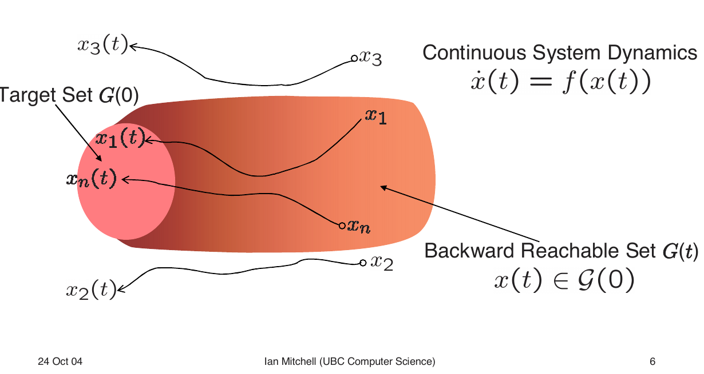

- A **continuous backward reachable set** is the set of all states from which trajectories can reach a given target set $G(0)$.

- Called **"backward"** to distinguish it from the *forward* reachable set.

- **To compute it, run the dynamics backward in time** from the target set.

> For safety, the target is usually the *unsafe* set, so the backward reachable set is the set of states doomed to become unsafe.

(Mitchell 2004, Reach Sets and the HJ Equation)

---

## 🎓 How to *Represent* the Set/Tube?

Computing a reachable set poses two coupled problems:

- **Represent** the set of reachable states.

- **Evolve** that set according to the dynamics.

 Inset: A sphere as an SDF — LevelSetPy (L. Molu), ACM TOMS 51(2), 2025.

---

## 🎓 Implicit Surface Functions

Level-set idea: Represent a set $G(t)$ as an **isosurface of a scalar function** $\phi(x,t)$1:

- **State-space dimension does not matter conceptually**: the same $\phi$ machinery works in any $n$.

- Surfaces **automatically merge and separate** as the set evolves.

- **Geometric quantities** (normals, curvature, distance) are easy to compute from $\phi$.

> Critical talk juncture: the reachable set is the zero sublevel set of a value function $\phi$.

 Inset: Set union of two spheres — LevelSetPy (L. Molu), ACM TOMS 51(2), 2025. · 1 Osher & Sethian

---

## 🎓 How to *Represent* the Set/Tube?

For continuous systems $\dot x=f(x)$, two families:

- **Lagrangian** (forward sets; restricted dynamics/shapes; overapproximation): HyTech, Checkmate, $d/dt$, ellipsoidal1.

- **Eulerian** (backward sets; general dynamics incl. competitive inputs; **implicit** set representation).
  - **HJ-Gauss** belongs here.

1 Kurzhanski

---

## 🎓 Canonical Example: Two Identical Vehicles

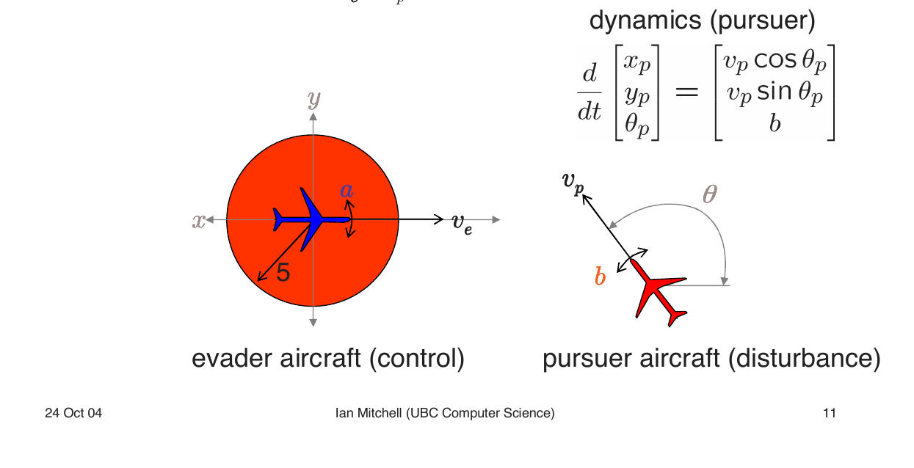

Classical collision avoidance:

- Collision if the vehicles come within **5 units** of each other.

- **Evader** picks turn rate $|a|\le 1$ to *avoid*;

- **Pursuer** picks $|b|\le 1$ to *cause* collision; fixed equal speeds $v_e=v_p=5$.

(Mitchell 2004, Reach Sets and the HJ Equation)

---

## 🎓 Canonical Example: Two Identical Vehicles

Classical collision avoidance:

- Work in **relative coordinates** with the evader fixed at the origin.

- State is relative position $(x,y)$ and relative heading $\psi$.

> NB: Same relative-coordinate pursuit-evasion (PE) game we solve with HJ-Gauss (Part 5); and the pairwise MAPF conflict of Part 6.

(Mitchell 2004, Reach Sets and the HJ Equation)

---

## 🎓 Evolve: The Time-Dependent HJ Equation

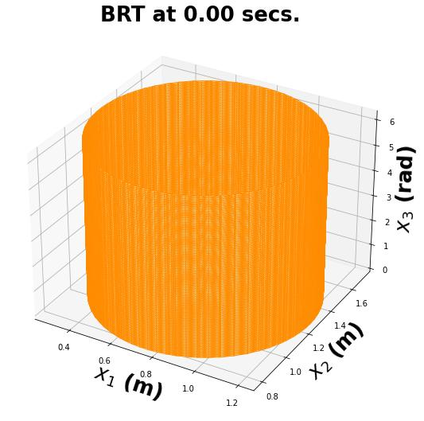

The set evolves by a (modified) Hamilton-Jacobi PDE:

- A **first-order hyperbolic PDE** whose solution can form **kinks** (discontinuous derivatives).

- The right weak solution is the **viscosity solution**1.

(Mitchell 2004, Reach Sets and the HJ Equation); viscosity: Crandall-Evans-Lions; level sets: Osher-Sethian · Dubins BRT: LevelSetPy (L. Molu), ACM TOMS 51(2), 2025 · 1 Crandall, Evans, Lions

---

## 🎓 Evolve: The Time-Dependent HJ Equation

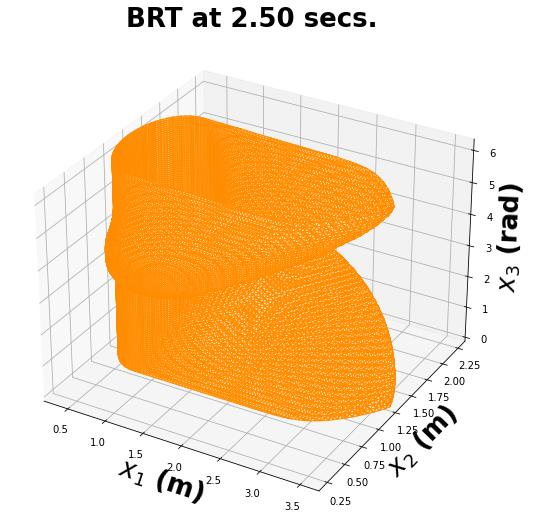

The set evolves by a (modified) Hamilton-Jacobi PDE:

- **Level-set methods** produce convergent numerical schemes1:

  - Non-oscillatory high-accuracy spatial derivatives;

  - A stable/consistent numerical Hamiltonian; and

  - Total variation-diminishing (TVD) high-order explicit time integration.

> This is the classical grid pipeline of Part C. HJ-Gauss tackles this computational cost.

(Mitchell 2004, Reach Sets and the HJ Equation); viscosity: Crandall-Evans-Lions; level sets: Osher-Sethian · Dubins BRT: LevelSetPy (L. Molu), ACM TOMS 51(2), 2025 · 1 Osher, Sethian

---

## 🎓 The Game Value and the Optimal-Stopping Fix

- The **terminal-cost differential game**:

  - Trajectories $\xi(\cdot;x,t,a,b)$;

  - **Value function** $\phi(x,t)$ is the viscosity solution of the HJ equation1.

> This modified/augmented Hamiltonian is the $\min\{0,\cdot\}$ freeze term on our HJI-RCBRT slide.

1 Evans & Souganidis, 1984

---

## 🎓 The Game Value and the Optimal-Stopping Fix

- To stop trajectories from passing *through* the target $G(0)$ (so the set is a **tube**, not just a set),

  - **Augment the disturbance input**;

  - The augmented HJ equation solves for the reachable set;

  - The augmented Hamiltonian is the modified $\min\{0,H\}$ Hamiltonian.

> This modified/augmented Hamiltonian is the $\min\{0,\cdot\}$ freeze term on our HJI-RCBRT slide.

---

## 🎓 Three Eulerian Approaches (All Equivalent)

The method sits among Eulerian formulations:

- **Static HJ**: Minimum time-to-reach1; (dis)continuous implicit representation; yields optimal-input information.

- **Viability kernels**: Set-valued analysis for very general dynamics2; discrete implicit representation; overapproximation guarantee.

- **Time-dependent HJ** (this method): Continuous solution, optimal-input information throughout the state space, high-order accurate.

> All three are **theoretically equivalent**; HJ-Gauss is a new *solver* for the time-dependent HJ formulation.

(Mitchell 2004, Reach Sets and the HJ Equation); Falcone/Sethian; Aubin/Saint-Pierre · 1 Falcone; Sethian · 2 Aubin; Saint-Pierre

---

## 🎓 Why It Matters: Two Applications

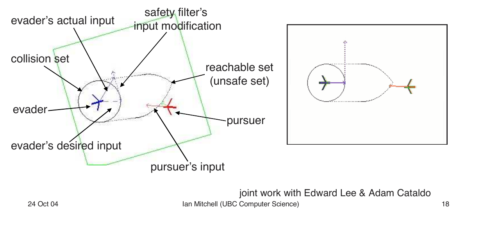

Reachable sets already drive real-world safety systems:

- **Softwalls for aircraft safety:** Filter evader's input so the pursuer never enters the reachable (unsafe) set — a certified safety filter (with E. Lee & A. Cataldo).

- **Collision alert for ATC:** Flag aircraft pairs whose flight plans intersect and whose relative state enters the collision region.

  - A one-hour Oakland-airspace sample: **1590 pairs, 25 detected conflicts, 2 false alerts**.

> These are the ancestors of the certified conflict predicate / shield we bring to warehouse MAPF in Part 6.

(Mitchell 2004, Reach Sets and the HJ Equation); Softwalls with E. Lee & A. Cataldo

---

## 🎓 Validation: Merz's Analytic Solution

- For **identical** **PE** dynamics, the reachable set admits an **analytic solution**1.

- Merz placed the pursuer at the origin; the game is **not symmetric**.

- That analytic solution is used to **validate the numerical algorithm**2 — the same discipline behind our LevelSetPy-vs-Monte-Carlo comparison in Part 5.

> Takeaway of the primer: reachability = represent implicitly, evolve in a HJ PDE game, solve for the viscosity solution.

> HJ-Gauss keeps this exactly and changes only *how* the PDE is solved.

(Mitchell 2004, Reach Sets and the HJ Equation); Merz (1972); Mitchell (2001) · 1 Merz, 1972 · 2 Mitchell, 2001

---

## 🛡️ Target Set and Zero Level Set

- The **target set** at horizon $T$ is the invariant set
$$ \mathcal L_0(T)=\{x\in\mathbb{R}^n:\ v(0,x)\le 0\}, $$
robustly controlled over the **distance-to-target** cost $g(0,x)$.
- Numerically $g$ is a **signed-distance function** $\ell(x)$ whose zero sublevel set is the target: negative inside, positive outside.

- The BRT is recovered as the **zero sublevel set** of the value function:
$$ x(t)\in\mathcal L(\cdot) \iff v(t,x)\le 0. $$

---

## 🛡️ The Hamilton-Jacobi-Isaacs Value Function

The value function of the RCBRT is the **viscosity solution** of the variational HJ-Isaacs equation

$$ v_t(t,x) + \min\{0,\ H(t;x,Dv)\} = 0,\qquad v(0,x)=g(0,x), $$

with the **game Hamiltonian**

$$ H(t;x,p)=\max_{u}\min_{w}\ \langle p,\ f(t;x,u,w)\rangle. $$

- The $\min\{0,\cdot\}$ **freeze** term makes the set only *grow* (a tube, not a set) — states already captured stay captured.

- For reach-avoid, the variational inequality couples the growth term with the obstacle datum $\ell$.

> This Hamiltonian is **positively 1-homogeneous in $p$, state-dependent, nonconvex, and sign-changing** across the barrier. Those four properties will rule out every convex-duality shortcut.

---

## 🛡️ Reach vs Reach-Avoid; Sign & Time Conventions

- **Backward-reachability convention:** $t$ is the **backward horizon** (time-to-go); the datum is posed at $t=0$ and the tube grows over $(0,T]$.

- **Reach (capture) tube:** $v_t+\min\{0,H\}=0$.

- **Reach-avoid tube (viscous):**
$$ \min\Big\{v_t^\delta+H^\delta-\tfrac{\delta}{2}\Delta v^\delta,\ \ g(t,x)-\ell(t,x)\Big\}\le 0. $$
- Physical time is $t_{\mathrm{phys}}=T-t$; the datum is the terminal cost in physical time.

> These conventions matter for signs during implementation and for *which* set (reach vs avoid) a negative value certifies. We adopt the backward-reachability viscosity-solution convention throughout.

---

## 🛡️ Why This Is the Right Safety Object

- **Worst-case, not average-case:** the RCBRT certifies safety against *all* admissible disturbances — the guarantee a safety case needs.

- **Geometric and set-valued, not trajectory-valued:** it characterizes *every* unsafe initial condition at once, not one rollout.

- **Composable:** the zero level set can be intersected, unioned, and propagated; it plugs into supervisory control and shielding.

- **Certificate-grade:** a signed value with an error bound yields a decision — SAFE / UNSAFE / UNDETERMINED (Part 4).

> The cost of this rigor is computational: solving the HJ(I) PDE. The rest of the talk is about paying that cost at scale.

---

<!-- _class: part -->

# Part C
## 🧱 The Grid Pipeline: LevelSetPy
**How Reachable Sets Are Computed Today — and Why It Is $O(M^n)$.**

**Molu. ACM TOMS 2025 · IEEE CDC 2024**

TOMS: ACM Transactions on Mathematical Software · CDC: Conference on Decision and Control.

---

## 🧱 The Level-Set Idea1

- Represent the reachable set implicitly as the **zero sublevel set** of $v(t;x)$ stored on a Cartesian grid.

- Evolve the interface by integrating the HJ PDE on the grid:

  - Discretize space (upwinding),

  - Stabilize the Hamiltonian (Lax-Friedrichs),

  - March in time (TVD-RK).

1 Osher-Sethian

---

## 🧱 The Level-Set Idea1

- **LevelSetPy** (our prior work) reimplements the 2004 MATLAB Level Set Toolbox in NumPy/CuPy, GPU-accelerated and interoperable with modern Python (PyTorch, SciPy, ROS).

| MATLAB ToolboxLS (2004) | LevelSetPy (2024/25) |
|---|---|
| CPU-only, single-threaded | NumPy + **CuPy GPU** |
| Slow for modern problems | Fast, batched, portable |
| No modern-library plug-in | ROS/PyTorch/SciPy compatible |

> LevelSetPy makes grid reachability *fast*. It does not change the *memory scaling* — the theme of Part 1.

1 Osher-Sethian

---

## 🧱 Implicit Surfaces & Signed-Distance Initialization

- The target set is initialized as a **signed-distance function** $\ell(x)$: negative inside, positive outside, $|\nabla\ell|=1$.

- Stored as an $n$-dimensional array over a Cartesian grid: $M$ points per axis → $M^n$ cells.

- Geometric primitives (spheres, cylinders, half-spaces) and boolean set operations (union/intersection/complement) are implemented as min/max on the level-set field.

- Example: a capture ball of radius $r$ is $\ell(x)=\|x\|-r$; a cylinder ignores the periodic $\theta$ axis.

> The implicit representation is elegant and closed under set algebra — but it stores the value at **every** grid node.

---

## 🧱 Spatial Derivatives via Upwinding

- The co-state $p=\partial v/\partial x$ must be approximated from grid values with the correct **direction of information flow** (upwinding) to remain stable at shocks.

- **First-order upwinding:** one-sided differences chosen by the sign of the characteristic speed.

- Left/right approximations $D^-v,\ D^+v$ feed the numerical Hamiltonian; the choice prevents differencing across a discontinuity.

$$ v_x(x,t)\approx \frac{\partial v(x,t)}{\partial x}\quad\text{(one-sided, direction by wind)}. $$

> Naive centered differences ring and go unstable at the barrier; upwinding is the minimal fix, refined next by ENO/WENO.

---

## 🧱 ENO: Essentially Non-Oscillatory Reconstruction

- **ENO** picks, among candidate stencils, the **smoothest** one to interpolate the derivative — avoiding stencils that straddle a shock.

- Orders implemented: **ENO2** (2nd), **ENO3** (3rd), via `upwind_first_eno2.py`, `upwind_first_eno3.py`.

- Higher order → sharper interface, lower numerical diffusion, at more stencil work per node.

> ENO chooses *one* smoothest stencil. WENO improves on this by blending stencils with adaptive weights.

---

## 🧱 WENO5: Weighted ENO Shock Capture

- **WENO5**1 forms a **convex combination** of three candidate substencils rather than choosing one, achieving 5th-order accuracy in smooth regions and non-oscillatory capture at shocks.

- Substencils on the grid index $i$:
$$ \{i-3,\dots,i\},\quad \{i-2,\dots,i+1\},\quad \{i-1,\dots,i+3\}, $$
combined with nonlinear weights that de-emphasize stencils crossing a discontinuity.
- Implemented in `upwind_first_weno5.py`.

> WENO5 is the workhorse for accurate reachable-set boundaries — and its per-node cost is one reason grid solves are expensive even before the memory wall.

1 Liu, Osher, Chan 1994

---

## 🧱 The Lax-Friedrichs Numerical Hamiltonian

- The analytic $H(x,p)$ is replaced by a **monotone numerical Hamiltonian** $\hat H(x,p^-,p^+)$ using the Lax-Friedrichs flux:
$$ \hat H = H\!\Big(x,\tfrac{p^-+p^+}{2}\Big) - \tfrac12\,\alpha\cdot(p^+-p^-), $$
with dissipation coefficient $\alpha=\max|\partial H/\partial p|$ over the relevant range (dimension-wise for global LF).
- Monotonicity guarantees convergence to the viscosity solution.

> The artificial dissipation $\alpha$ is a *numerical* cousin of the viscosity $\delta$ — both stabilize the barrier. HJ-Gauss will trade the grid's LF dissipation for the analytic $\delta$.

---

## 🧱 Time Integration: TVD Runge-Kutta

Method of lines + **Total-Variation-Diminishing Runge-Kutta**1, so the interface does not spuriously oscillate:

- **Forward Euler (1st):** $v^{n+1}=v^n+\Delta t\,L(v^n)$, $L=-\hat H$.

- **TVD-RK2:** Euler step to $v^{(1)}$, second Euler step, then convex average $v^{n+1}=\tfrac12 v^n+\tfrac12 v^{(2)}$.

- **TVD-RK3:** three stages with convex-combination weights $(1),(3/4,1/4),(1/3,2/3)$.

> TVD-RK preserves monotonicity of the spatial scheme in time. Each stage is a full grid sweep.

1 Shu-Osher

---

## 🧱 The CFL Condition

- Explicit integration is stable only under a **Courant-Friedrichs-Lewy** step restriction:
$$ \Delta t\ \le\ \frac{\text{CFL}}{\ \sum_i \max|\partial H/\partial p_i|/\Delta x_i\ },\qquad \text{CFL}\in(0,1). $$
- Numerical information must not travel more than one grid cell per step.

- Finer grids ($\Delta x\downarrow$) force **smaller $\Delta t$** → more steps → compounding the cost.

> CFL couples spatial and temporal resolution: refining space to sharpen the barrier makes *both* the memory and the step count worse.

---

## 🧱 Package Anatomy & a Worked Example

| Module | Role |
|---|---|
| `grids`, `initialconditions` | Cartesian grids, signed-distance shapes |
| `spatialderivative` | Upwind first, ENO2/3, WENO5 |
| `explicitintegration` | Lax-Friedrichs Hamiltonians, TVD-RK, CFL |
| `dynamicalsystems` | Vehicle models (Dubins, rockets) |
| `visualization` | Isosurface / marching cubes rendering |

- **Worked example:** the rockets-launch pursuit-evasion game; 2D $(x,z)$ slices of the 3D relative-state BRT, evolved backward over $(0,T]$.

- Multi-agent verification: flocks/murmurations partitioned into per-flock games.

> A clean, tested, GPU-portable stack — the state of practice we now try to move beyond.

---

## 🧱 Grid Complexity: The Accounting

- **Memory:** $O(M^n)$ — store the value (and gradient) at every node.

- **Time per step:** $O(M^n)$ node updates × stencil width × RK stages, under a CFL-bounded step count.

- GPU acceleration cuts the *constant* and parallelizes node updates, but the **exponent $n$ is untouched**.

$$ n=6,\ M=100\ \Rightarrow\ 10^{12}\ \text{cells}\ \approx\ 8\ \text{TB per double array}. $$

> This is the wall. Part 1 quantifies it and surveys who has tried to climb it.
