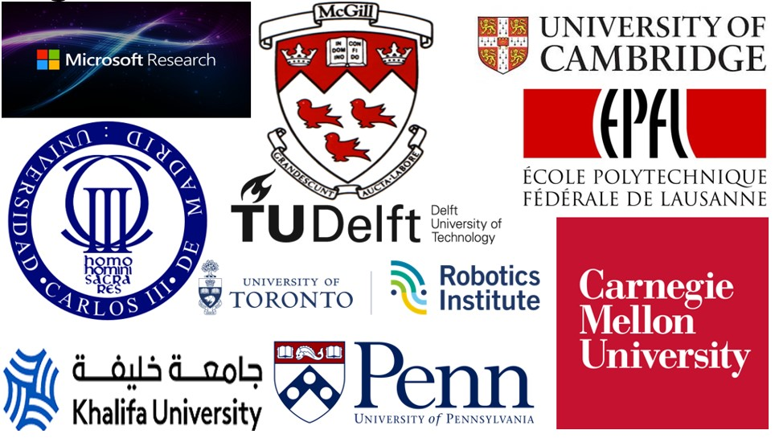

<table class="table table-hover" > </table>

### **ICRA 2025 Workshop on Soft Robotics**

> **This page is under active development. Please check back from time to time to see updates on plans and specifics as the conference date nighs.**

This page is the one-stop shop for all workshop information including invited speakers, panel debates, spotlight talks, call for extended abstracts, cutting-edge and bleeding-edge ideas meant to stimulate the community of soft roboticists towards reviving the (now decade-old) promise of embodied intelligence, realized via morphological computation, for robotic designs with adaptive motion strategies. Morphological computation as a design principle was originally envisioned by Helmut Hauser and colleagues a decade ago in their seminal [opinions and outlook on morphological computation](https://philpapers.org/rec/HAUOAO) compendium. See [Zambrano and colleagues](https://www.iris.sssup.it/handle/11382/461975)'s work for a balanced and ballasted elucidation on applying them for robotic designs.

### **Abridgment**

**Embodied intelligence**, enabled by **morphological computation** in natural organisms, is the foundational principle that buoys the design, manufacture, model-based, and model-free control of soft robots [1]. This workshop will bring together researchers working at  the bleeding-edge of morphological computation as a design principle for the build, precise mathematical- and learning-based characterization of the deformation, model, and control of soft robots in everyday automation tasks.  Research themes will focus on **compositional designs for sensing and motor actuation**,  **reduced-order approximate mathematical models** for continuum bodies, **supervised and reinforced learning** models, **morphological computation for control** that tame the modeling complexity associated with continuums' complex kinematics and their forward/inverse dynamics; lastly, we will visit emerging control techniques involving **time-scale separation and layered architecture for (near) real-time control**. All in all, we shall reiterate the **foundational vision of morphological computation for compliant bodies**, examine the state-of-the-art in their **design, control, and modeling techniques**, highlight mission gaps so far, and <u>coalesce community efforts around the possibilities of compliant continuum bodies’ morphological computation, not as problems, but rather as useful computational resources to be leveraged throughout the design, modeling, control, and motion execution process cycle</u>.

### **Organizers, panelists, and speakers**

    

<!--  -->

- <a href="mailto:lekanmolu@microsoft.com" class="author-social" target="_blank"><i class="fa fa-fw fa-envelope-o"></i></a>  [Lekan Molu](scriptedonachip.com) (principal contact): Senior Researcher, Microsoft Research NYC, USA.

- <a href="mailto:audrey.sedal@mcgill.ca" class="author-social" target="_blank"><i class="fa fa-fw fa-envelope-o"></i></a>  [Audrey Sedal](macro.lab.mcgill.ca):  Assistant Professor of Mechanical Engineering, McGill University, Canada.

- <a href="mailto:josie.hughes@epfl.ch" class="author-social" target="_blank"><i class="fa fa-fw fa-envelope-o"></i></a> [Josie Hughes](https://people.epfl.ch/josie.hughes?lang=en): Assistant Professor, École polytechnique fédérale de Lausanne, Switzerland.

- <a href="mailto:cosimodellasantina.eu" class="author-social" target="_blank"><i class="fa fa-fw fa-envelope-o"></i></a> [Cossimo Della Santini](https://cosimodellasantina.eu/): Assistant Professor, Department of Cognitive Robotics, TU Delft University of Technology, Netherlands.

<!-- - <a href="mailto:rkk@ethz.ch" class="author-social" target="_blank"><i class="fa fa-fw fa-envelope-o"></i></a>  [Robert Katzschmann](https://srl.ethz.ch/the-group/prof-robert-katzschmann.html): Assistant Professor, Department of Information Engineering and Process Engineering, ETH Zurich, Switzerland. -->

- <a href="mailto:cmonje@ing.uc3m.es" class="author-social" target="_blank"><i class="fa fa-fw fa-envelope-o"></i></a> [Concepcion Alicia Monje Micharet](https://es.wikipedia.org/wiki/Concha_Monje), Professor of Soft Robotics, Humanoids, and Control, Universidad Carlos III De Madrid, Spain. 

- <a href="mailto:crsung@seas.upenn.edu" class="author-social" target="_blank"><i class="fa fa-fw fa-envelope-o"></i></a>  [Cynthia Sung](https://sung.seas.upenn.edu): Associate Professor, Mechanical Engineering & Applied Mechanics, University of Pennsylvania, Philadelphia, USA.

	
- <a href="mailto:federico.renda@ku.ac.ae" class="author-social" target="_blank"><i class="fa fa-fw fa-envelope-o"></i></a> [Federico Renda](https://www.ku.ac.ae/college-people/federico-renda): Associate Professor, Department of Mechanical Engineering, Khalifa University, Abu Dhabi, UAE. 

- <a href="mailto:jessica.burgnerkahrs@utoronto.ca" class="author-social" target="_blank"><i class="fa fa-fw fa-envelope-o"></i></a>  [Jessica Burgner-Kahrs](https://www.cs.toronto.edu/~jbk/):  Professor of Mathematical and Computer Sciences, University of Toronto, Ontario, Canada.

- <a href="mailto:cmajidi@andrew.cmu.edu" class="author-social" target="_blank"><i class="fa fa-fw fa-envelope-o"></i></a>  [Carmel Majidi](https://sml.me.cmu.edu/): Professor of Mechanical Engineering, Carnegie Mellon University, Pittsburgh, PA, USA.

- <a href="mailto:fi224@eng.cam.ac.uk" class="author-social" target="_blank"><i class="fa fa-fw fa-envelope-o"></i></a> [Fumiya Lida](https://mi.eng.cam.ac.uk/Main/FI224):  Professor of Robotics, Cambridge University, Department of Information Engineering, Cambridge, Cambridgeshire, United Kingdom. 

###  **Significance**

Natural organisms with embodied intelligence (EI) exploit their intrinsic morphological computation by integrating internal control computations with their structure for adaptive motion strategies. EI has inspired new design, modeling, and control paradigms in adaptive automation – yielding more improved robot mechanisms, specifically soft robots. In this design philosophy, rather than reject external disturbances and physical constraints, continuum soft robots must harness external forces and physical constraints for improved stiffness-to-weight ratio, bending, torsion, and twisting capabilities etc -- behaviors unlike of rigid robots. However, most design, modeling, and control schemes do not fully take advantage of these foundational principles. Novel mechanism designs are emerging given recent advances in material engineering. Even so, new kinematics, kinetics, and control methods for continuum robots are emerging. This workshop will bring together researchers at the forefront of these research thrusts to disseminate recent findings and best practices to the robotics community. Aspiring towards the theoretical foundations of embodied intelligence [5, 7], we  will explore: (i) harnessing natural organisms’ EI in soft robots’ mechanism design; (ii) precise mathematical modeling tools  for predicting soft mechanisms behavior -- via ODE-based reduced-order finite dimensional control, and PDE-based modeling of continuum robots; (iii) emerging control methods for managing model complexity via time-scale separation and layered control architectures; and (iv) the power of machine learning from sensory experimental data to model and control behavior. 

### 	**Motivation and Themes**

### **Physical Design and Morphological Computation** 

Well-orchestrated as a design principle, EI can enable sophisticated reaching, morphing, grasping, growing, walking, crawling, swimming, or jumping motions that are useful in everyday assistive technologies, loco-manipulation, or navigation tasks. The first section of the workshop will involve speakers and practitioners leveraging EI philosophy in the design and fabrication of new chemical compounds and materials for soft robot mechanisms, reconfigurable and fiber-reinforced elastomeric continuum designs etc.

### **Mathematical Modeling**

Since soft robots exhibit infinite degrees-of-freedom and distributed mass, when modeled exactly as a continuum body nonlinear partial differential equations (PDEs) are the standard mathematical modeling tools for analysis. However, scanty theory exists for nonlinear PDE analyses; and researchers have hitherto been utilizing approximate finite-dimensional ordinary differential equations (ODEs) [3] as plausible alternative modeling means. Recent efforts in the community have demonstrated the power of reduced order and approximate finite-dimensional models undergoing finite elastic deformations including piecewise constant strain, constant curvature and variable strain models. For large deformations, variable curvature models based on elliptic integrals or Cosserat theory are becoming more paramount in modeling nonlinear elastic deformation models that yield accurate results. The modeling section of this workshop will feature researchers working on these emerging models to disseminate the latest advances with these modeling tools.

### **ML-based Modeling**

While mathematical tools often come in handy for executing precise behaviors on soft robots, they are often not readily available, often  difficult to develop, or the practicing engineer may not have the skillset to derive a closed-form model. Machine learning is now widely accepted as a modeling means for various cyberphysical systems. For the complex internal dynamics of a soft robot to match the physical interactions of the external environment, the question is not whether machine learning (ML) should be incorporated into soft robotic systems but how? The ML-based modeling section of the workshop will consider empirical approximation models of the soft robot that enable learning forward and inverse causal dynamics from inputs to states to outputs and vice versa. 

Sessions under these theme shall focus on supervised learning approaches for modeling the forward dynamics of soft robots. For non-convex datasets gathered experimentally, we will explore learning inverse dynamics models from actuator to configuration space dynamics, and from configuration to task space dynamics. In addition, given the recent model-free, on-policy, and off-policy reinforcement learning advances, we will explore their efficacy in learning model and control strategies for soft robots in determining compliant response to external stimuli. 

### **Control of Soft Robots**

Soft robot control techniques abound from model-based designs [3, 4] on reduced-order finite-dimensional models [4], PDE-based control, to learning-based control approaches [5]. The number of publications in the control of soft robots has witnessed a meteoric rise from a measly 104 in 2012 to 2,358 publications in 2021 [5]. We will take an all-of-the-above strategy in exploring the control schemes that have found success stories in physical and virtual applications so far. Themes under consideration include but are not limited to fractional-order calculus-based methods, reduced-order approximate ODE models, optimal and adaptive control, as well as learning-enabled control with Cosserat models among others.

### **Format**

We propose a stimulating audience participation to be engaged via panel debates amongst key speakers; intentional diversity of high-profile speakers that cut across gender, race, geography, industry, and academe. This will draw a well-balanced and ballasted participation from the robotics and automation society, bringing representation of women and underrepresented members of the community together as we catalyze interest in our proposed themes. A hybrid mode meeting option (in-person and online) with contemporary interactive software tools (including Teams and Gather.Town) will help engage online registered participants and speakers who cannot travel in person; we will coordinate extensively with the ICRA organizers' audio-visual team so that we have a seamless delivery of content to the hybrid audience/participants. 
A technical portion of the program shall be discharged by the organizers highlighting the current state-of-the-art with respect to soft robots’ embodied intelligence, new advances in physical materials that enable improved designs, numerical algorithms and benchmarks for computational models and control.  Each speaker’s talk on topics will be followed by a Q&A round to encourage discussion. There will be solicitation for workshop paper submissions in the form of extended abstracts prior to the conference. We will leverage mediums such as robotics worldwide email lists, x.com, and other impactful media campaigns for high visibility to engender broad participation and engagement. Spotlight talks drawn from the best workshop abstract submissions will garner engaging participation from attendees and a poster session for other runner-up accepted abstracts will facilitate possible future collaborations among attendees. We will live stream the workshop using YouTube live streaming, with public access to those with the link. To avoid fatigue and facilitate a rich exchange of information and ideas, we propose interactive activities in breakout sessions, and ten-minute tea breaks before the top of every hour of the workshop.

### **Plan to encourage interaction among participants**

Across all our organizers, we have well over 21,000 followers on x.com and LinkedIn. Thus a targeted social media campaign will attract participants widely from industry and academia, with disciplines not limited to robotics -- covering manufacturing, computer-aided simulation of deformable bodies, computer graphics, and control systems. We will further be supported in this social media campaign by our invited speakers and their institutions / company profiles. The social media campaign will highlight the workshop’s exciting dynamic format including the panel debates, interactive tools, and spotlight presentations. In addition to social media, we will use traditional means of attracting participants including the robotics-worldwide mailing lists. 

### **Speakers' Talks**

Various topics surrounding the goals of the workshop shall be given priority amongst our speakers. Each speaker will have a 30-minute session to highlight a bird's eye view of their expert contributions to specific topics under consideration. We have strived as much as possible to enlist the most prolific researchers on the specific themes (Please see our speaker biographies and proposed topics section of this proposal).

### **Panel Debate**

Details of all the talks (title, abstract and speaker bio) will be made available online prior to the workshop, including access to accepted workshop papers. Our workshop will consist of 2x 45-minutes debate sessions involving 3 speakers from our organizers list. The topics of the debate along with the participating speakers are provided in Table I.

<!-- ### Dissemination plan for Workshop Outcomes -->
### **CFP: Extended Abstracts **

We shall invite participants across all career stages on the delineated workshop thrusts above to submit extended abstracts of up to 4 (2 + n) pages with no page limits for bibliography or appendices in the IEEE conference style paper submission format. Papers shall be submitted on Microsoft’s cmt3 conference management toolkit. Call for submissions will be broadly advertised to the robotics and automation community via KIT's robotics-worldwide listserv along with an intensive social media campaign to encourage broad participation in the engineering and research community.  The organizers shall solicit paper reviews by distinguished experts and qualified reviewers  from the IEEE RAS publications reviewing program; and all accepted papers shall be hosted on github for free accessibility by the robotics community. To the extent possible, we shall solicit original contributions; when not possible, papers that demonstrate novelty in either new design techniques or modeling/control methodologies shall be given a strong weighting. Acceptance shall be based on novelty of ideas, demonstration(s) of proof-of-concept -- ongoing and completed, accessibility of submissions, clarity and accuracy of presentation, and  the overall quality of the submission. We anticipate receiving close to 200 abstract submissions based on perceived interest in these themes in the community. 

### **Spotlight Talks**

First-class submissions shall be chosen among the reviewed submissions (based on assigned grades by the reviewers) for spotlight talks during the workshop. Talks shall consist of ten-minute rapid-succession presentations by no more than six presenters in an hour-long session of the full-day workshop.

### **Poster Sessions**

Submissions rated just below excellent by reviewers shall be assigned to a poster session that follows after speakers talk sessions. The mode will be interactive in nature with presenters able to engage their audience with either printouts of posters or via electronic projectors. Each presenter will be assigned a wall location at the workshop venue prior to the start of the workshop. During the break at noon, preenters shall attach or display their posters and the poster session shall commence right after lunch.

### **Diversity and Inclusion**

Our organizing committee and speakers list are composed of a diverse mix of first-rate researchers that cut across gender, geography, academia and industry and various career stages. This will engender participation from a very broad audience during and before the workshop event. We will actively target participation from underrepresented communities by soliciting such groups to help disseminate the workshop plans among their members.

### **Compliance with Robotics and Automation Society (RAS) Guidelines**

This workshop will serve the robotics community with up-to-date best design practices inspired by improvements in materials science and engineering, often aided by design principles from biological systems; recent precise mathematical and learning-based modeling tools that integrate the morphological computation concept; and the emerging control schemes such as fractional-order control methods [4] coupled with advances in learning-based approaches for the modeling and control of soft robots.

We confirm that the organizers will be present at the workshop (in person and online) and that the workshop will comply with the [RAS Guidelines](https://www.ieee-ras.org/conferences-workshops/resources-for-workshop-organizers).

### **Speakers**

We have strived to for inclusivity in speakers from diverse academic backgrounds, thoughgt-leadership, geography, demographics, career stages, and gender across academia and industry. We have honed our focus in particular on speakers that have high-impact work in the research community -- prominent examples include Professors Federico Renda, Carmel Majidi, Monje Micharet, and Fumiya Lida. 

- **Professor Federico Renda** pioneered the geometrically exact Cosserat beam model as an approximate reduced-order ODE modeling scheme for soft slender robots undergoing finite deformations. His piecewise constant strain model and variable strain models based onCosserat rod theory are widely employed in the modeling and model-based control of soft robots.  His models have been extensively used in the optimal control and motion understanding of popular soft robots such as Professor. Cecilia Laschi's [Octopus robot](https://spectrum.ieee.org/robot-octopus-points-the-way-to-soft-robotics-with-eight-wiggly-arms). 

- **Professor Fumiya Lida** is a well-regarded international leader in the robotics community; his research efforts are centered around natural biological inspiration for developing core competences in the the rapid prototyping of dynamic mechatronics systems, bionic sensor and motor technologies, and computational control optimization techniques. His focus is to leverage the adaptivity and autonomy of animals for engineering novel robotic applications which are more adaptive, resilient, and energy efficient.

- **Professor Carmel Majidi** is an accomplished materials science and engineering researcher with broad recognition in the academic community for bringing novel materials, hardware architectures, and fabrication methods to fruition for the safe execution of soft biological organisms behaviors during human interactions. His lab focusses on replacing bulky, rigid hardware with low stiffness-to-weight ratio soft robots that leverage the embodied intelligence of functional living tissues. Towards rapid prototyping and robotics implementation of automation ideas, his lab is focussed on filled-elastomer composites and soft microfluidic systems that exhibit unique combinations of mechanical, electrical, and thermal properties and can function as “artificial” skin, nervous tissue, and muscle for soft robotics and wearables.

### **Important Dates**

-	February 2025, Week III (Submission deadline for call for extended abstracts)
-	March 2025, Week III (Decision Notification)
-	April 2025, Week II (Final submission deadline)

### **References**

[1]  Hauser, Helmut, and Fuchslin, Rudolf M., and Pfeifer, Rolf. “Opinions and Outlooks on Morphologcal Computation.” 2014.

[2] Yap, Hong Kai, Nazir Kamaldin, Jeong Hoon Lim, Fatima A. Nasrallah, James Cho Hong Goh, and Chen-Hua Yeow. "A magnetic resonance compatible soft wearable robotic glove for hand rehabilitation and brain imaging." IEEE transactions on neural systems and rehabilitation engineering 25, no. 6 (2016): 782-793.

[3] Della Santina, Cosimo, Christian Duriez, and Daniela Rus. "Model-based control of soft robots: A survey of the state of the art and open challenges." IEEE Control Systems Magazine 43, no. 3 (2023): 30-65.

[4] Monje, Concepción A., Bastian Deutschmann, Jorge Muñoz, Christian Ott, and Carlos Balaguer. "Fractional order control of continuum soft robots: Combining decoupled/reduced-dynamics models and robust fractional order controllers for complex soft robot motions." IEEE Control Systems Magazine 43, no. 3 (2023): 66-99.

[5] Laschi, Cecilia, Thomas George Thuruthel, Fumiya Lida, Rochdi Merzouki, and Egidio Falotico. "Learning-based control strategies for soft robots: Theory, achievements, and future challenges." IEEE Control Systems Magazine 43, no. 3 (2023): 100-113.

[6] Molu, Lekan, and Chen, Shaoru. “Structural properties and control of soft robots modeled as discrete cosserat rods.” IEEE Conference on Control and Decision-Making, 2024, Milan, Italy.

[7] ] H. Hauser, A. J. Ijspeert, R. M. Füchslin, R. Pfeifer, and W. Maass, “Towards a theoretical foundation for morphological computation with compliant bodies,” Biol. Cybern., vol. 105, nos. 5–6, pp. 355–370, Dec. 2011

[8] Evans, Lawrence C. Partial differential equations. Vol. 19. American Mathematical Society, 2022.
