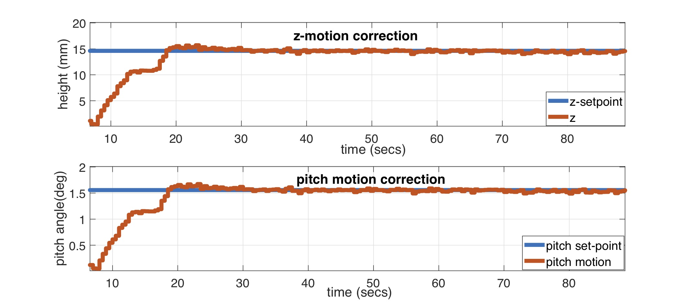
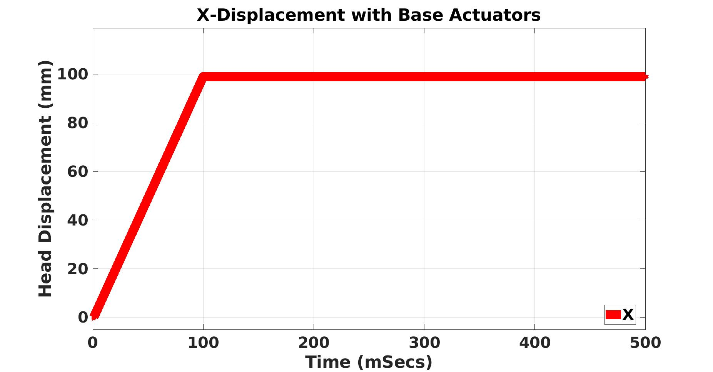
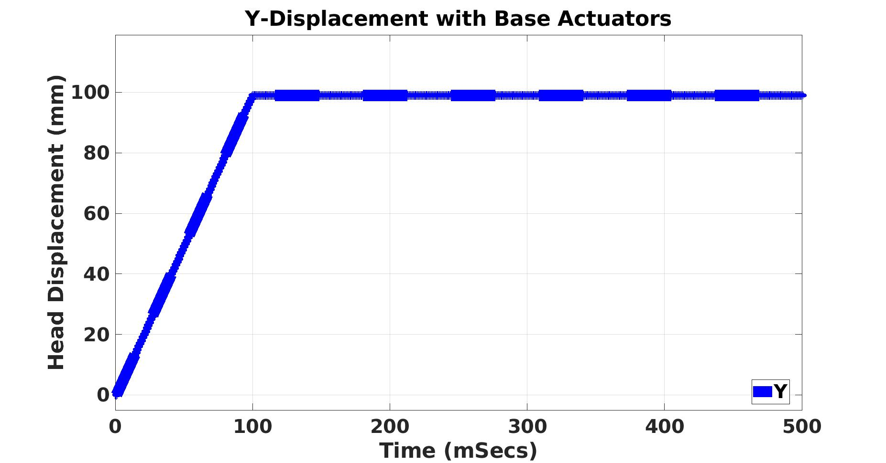
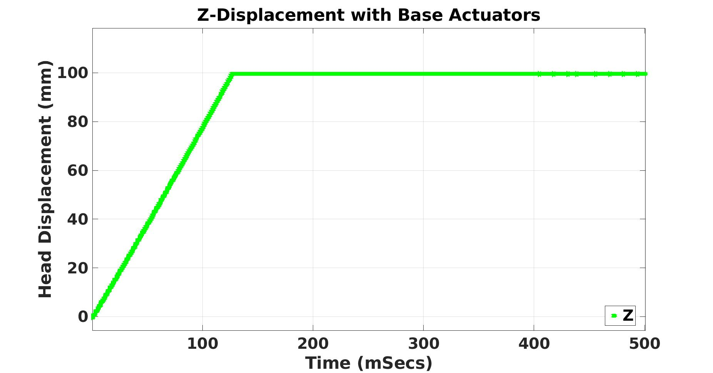

<?php include_once("analyticstracking.php") ?>

### Research Abridgment

**Patient Motion Control in MRI-LINACs with Soft Robots**

### [Table of Contents](#table-of-contents)
<!-- - [Goals](#goals)
- [Aims](#aims)
- [Applications](#applications)
- [Advantages](#advantages) 
- [Proposed Setup](#proposed-setup)
- [Background/Motivation](#motivation)
- [Existing Technologies amd Limitations](#existing-technologies)
-->
- [Preliminary Experimental Videos](#videos)
- [System Design and Contruction](#system-design-and-contruction)
    - [Soft Actuator Geometrical Model](#actuators-geometrical-model)
    - [Equiaxial Deformation](#deforms)
    - [CCOOARSE Deformation](#ccoarse)

> For Background, please see [this page](/research)

<!-- #### **Goals**

- [x] Non-magnetic patient motion stabilizing mechanism compatible with magnetic resonance imaging (MRI) machines  
- [x] Radio-transparent patient motion stabilizer for _real-time_ and _precise_ cancer radiation therapy modalities
- [x] Verify our leading hypothesis to see if a 6-DOF target motion of a patient is <= 0.5 mm and <= 0.5 deg for greater than 95% of the treatment time.

#### **Aims**
- [ ] Simulation of an advanced 6-DOF motion compensation system soft robot for MRI-LINACs

- [ ] Design and construction of an MRI-LINAC soft robotic motion correction mechanism

- [ ] Phantom-based and healthy human volunteer trials

These exploratory experiments are relevant to public health and have transformational clinical potential because they may provide:

- proof-of-concept evidence that soft robots are compatible with standalone MRI imaging modalities;

- evidence of precise and automatic motion management with non-magnetic and radiation-transparent soft robots in emerging hybrid MRI-accelerator RT;

- an emergence of a better brain and head and neck (H&N) cancer management technology that can be adapted to confined spaces under MRI coils.

#### **Applications**

This technology shall be applicable for the following use-cases:

- [x]  Standalone MRIs

- [x]  Emerging MRI-LINAC technologies

- [x]  Head and Neck Cancer Radiation Therapy

- [x] Brain Cancer Radiation Therapy

#### **Advantages**

- [x] Negate the deleterious effects of **interfractional** setup variation on patients;

- [x] Correct the complex **intrafractional geometric uncertainties** such as posture changes, and body deformation with minimal invasiveness;

- [x] Eliminate **radiation attenuation** associated with the metallic components of frames and rigid robotic patient motion compensation systems;

- [x] Correct the **flex drifting errors** associated with thermoplastic face masks;

- [x] Do **not interfere with the MRI's magnetic field**.

#### **Proposed Setup**



 
_Fig 1. Systematic parallel configuation of hollow soft domes around the patient's cranium._

<a name='motivation' />
### **Background and Motivation**

- Current radiation therapy (RT) treatment modalities use computed tomography scans of body tissues to segment organs before treatment.

- Accurate radiation dose targeting requires subdegree and submillimeter patient motion correction.

- These CT images lack fine contrast that distinguish bony-tissues from non-bony and soft tissues. High contrast delineation of cancerous tissues from healthy surrounding tissues can further improve dose escalation to the tumor while simultaneously sparing surrounding healthy tissues; this is especially true for brain or head and neck (H\&N) cancers.
- Magnetic resonance imaging (MRI) is an advanced imaging modality of internal body organs. Combined with RT, MRI-based RT is becoming an emerging technology with the potential for improving target and organs-at-risk (OAR) contrast for brain and H\&N cancers.
- Recent research directions have demonstrated the compatibility of MRI with linear accelerator (LINAC)-based photon treatment of cancers.  Unfortunately, the quality of MRI imaging is limited by the artifacts caused by patient head motion.  
- **_What if we could automatically correct patient motion during MRI imaging/RT/stereotactic radiosurgery so that we can eliminate the deleterious effects of patient motion uncertainities in MRIs, and photon/proton-based therapies? How do we negate patient motion?_**

<a name='existing-technologies' />
### **Existing Technologies and Limitations**

- Currently in clinics, we use a frame or an immobilization mask to render the patient static while they lie supine on a couch
    - &#9746; This is incapable of real-time closed-loop feedback head motion corrections when the treatment beam is on (See Fig. 1).
    - &#9746; The invasiveness, inconvenience and discomfort associated with the frame are a principal cause of poor patient compliance and poor clinical efficacy.
    - &#9746; For some patients, frame placement is not possible due to extreme cranial anatomy or prior surgical bone flaps. In addition, the frame prohibits cases when multiple RT deliveries are needed as patients cannot be subjected to daily attachment and removal of the frame.
    - &#9746; The limitations of frames has spurred clinics using thermoplastic face masks. These result in decreased accuracy arising from mask flex (drift of up to 2-6mm), and changes in the mask from repeated application and shrinking
    - &#9746; Such inaccuracies are not suitable for deep tumors located near critical structures such as the brain stem or for newer treatment modalities such as single isocenter multiple-target stereotactic radiosurgery (SRS), which are highly sensitive to rotational head motions.


_Fig 2. L-R (a) The Brown-Robert-Wells SRS frame; (b) the thermoplastic face mask in classical RT (c) a thermoplastic facemask with add-on MRI coils in MRI imaging (d) the Wiersma Stewart-Gough model (e) the Ostyn robot_

- Recent research directions
    - &#9746; Explorative robotic positioning research studies have  demonstrated the feasibility of maintaining stable patient cranial motion consistent with treatment plans. For example, the  Wiersma Lab's Stewart-Gough platform, illustrated in Fig 1d, achieves <= 0.5mm and <= 0.5 deg positioning accuracy 90% of the time, while the Ostyn six degrees-of-freedom (DOF) plastic Stewart-Gough platform (Fig. 1e) uses stepper motors to actuate the legs of its parallel plastic platform.
    - &#9746; These systems, while aiding better clinical accuracy, utilize rigid metallic components, electric motors and linear actuators which are not suitable for MRI imaging: they interfere with the magnets of the MRI machine and can lead to patient fatality or significant damage to the MRI machine.

{%
    include fig.html
        file='downloads/soro/mri_coils.jpg'
        height=200
        max-width='100%'
        align='middle'
%}
 
_Fig 3. MRI Treatment Setup. &copy; Kevin Teo/Rodney Wiersma, UPenn Radiation Oncology. L-R (a) Patient immobilization with thermoplastic masks under the MRI tube (b) the MRI coils are typically overlaid on the mask above the patient's face (c) owing to the large magnetic fields of the MRI machine, metallic objects are not admissible. Hence, parallel rigid mechanisms such as the Wiersma or Ostyn robot would not be feasible. These lack soft compliance necessary in such advanced imaging modalities._

- The CyberKnife Synchrony, while capable of precise, non-surgical tumor and lesions treatment in SRS and stereotactic body radiotherapy (SBRT), only executes _a-priori_ trajectories (see Fig 4).

- Real-time closed-loop head motion compensation for the CyberKnife system is inhibited by its high load-to-weight ratio which indirectly affects its repeatability
    - Given its stiffness (it weighs 160kg), it has a complicated actuation system so that its passive bending stiffness overwhelms the degree of deformation for rapid patient repositioning.


 
_Fig 4. The Cyberknife system ©Cyberknife._ -->

<!-- **Proposal: A 6-DOF Soft Robot Patient Motion Correction Mechanism for MRI-guided Adaptive Radiation Therapy.** -->

### **Preliminary Experiments**

#### **3-DOF Head Motion Control**

What I describe in what follows is based on our Gen. 1 soft actuators.  A head phantom was 3D printed from stereolithography using fused deposition modeling (FDM) technmology. To model the neck's free motion, we 3d printed a ball and socket joint, and attach it to the hollow end of the head phantom, which  lies supine on a couch. 

The soft actuators are made from silicone. In the reference configuration, they are flat and rectangular in physical texture. We connect silicone hose fitiings to each end of the soft silicone (these convey compressed air in and out of the actuators) and we then encased the robot in breathable foam pads for patient comfort.  These actuators are in a cuboidal shape in their current configuration. We use air to inflate the actuators because it is 

- cheaply available; 
- clinically-friendly ;
- inviscid; and 
- it allows us to rapidly iterate different prototypes in realizing our objectives. 

Proportional solenoid valves, controlled by PWM voltages generated from our microcontroller, regulated the volume of air within each actuator. We use a high-fidelity 3D depth vision sensor to measure the head position in real-time after point clouds processing. This information is fed back in a feedback loop to the proportional solenoid valves.

With a combination of indirect adaptive control and system identification, we derive an asymptotically-stable Lyapunov controller[IROS17] to stabilize the head motion along three axes of motion, viz., z, pitch and roll. The figures below depict our setup and results along the axes of motion.


_Fig 4: System Setup [Old IAB Model]_

 

_Fig 5: 3-DOF Head motion control example [Old IAB Model]_

 

<!--  -->

#### **6-DOF Head Motion Control Proposed Setup**



 
_Fig 6. Parallel configuation of hollow C3 soft domes around the patient's cranium._ 

<!-- ### System Design and Contruction -->

#### **New Actuators Geometrical Model**

we now propose a new class of continuum, compliant and configurable (C3) soft actuators which only deform along the radial direction (see computer model in Fig. 5.) based on the physical constraints baked into the elastomer-fabric matrix. Inspired by the behavior of  the skin papillae of certain cephalopods (octopus, cuttlefish, bivalves and mollusks) which can transform their physical texture from 2D to 3D in less than  2 seconds, we have fabricated   bio-inspired soft elastomers that are planar in their reference configuration and exhibit a radially symmetric deformation when constrained along their circumferential axis under pneumatic actuation in their current configuration.  There is no electrical wirings or electronic circuits involved in reaching a desired configuration.



 
_Fig. 5. Actuator Model_

<a name="deforms">
#### **Equiaxial Deformation**

Suppose we inflate the unconstrained planar rubber material, we would notice a deformation along the circumferential and axial directions as shown below. The constitutive relation that governs the deformation behavior along 2-DOFs is very involved would waste a lot of computational resources in solving for the kinematics of the overall system. 



 
_Fig. 6. Bulge upon pneumatic actuation._

**Equiaxial Deformation Videos**

<iframe src="/downloads/soro/circ_bulge_real.mp4" width="240" height="240" frameborder="0" marginwidth="0" marginheight="0" scrolling="no" style="border:3px solid #666; margin-bottom:5px; max-width: 48%;" allowfullscreen> </iframe>

<iframe src="/downloads/soro/circ_bulge_real2.mp4" width="240" height="240" frameborder="0" marginwidth="0" marginheight="0" scrolling="no" style="border:3px solid #666; margin-bottom:5px; max-width: 48%;" allowfullscreen> </iframe>

<iframe src="/downloads/soro/circ_bulge_real3.mp4" width="240" height="240" frameborder="0" marginwidth="0" marginheight="0" scrolling="no" style="border:3px solid #666; margin-bottom:5px; max-width: 48%;" allowfullscreen> </iframe>

<a name='ccoarse' />
#### **CCOARSE Deformation**

To circumvent the complicated constitutive law, we constrained the axes of the deformation by baking a fiber matrix into the rubber material during manufacture. We laser-cut concentrically circular fibers, and lay them on the uncured silicone. I further added a silicone topcoat and then allowed the rubber material to cure. Upon inflation, we notice a deformation along the radial direction only as illustrated in the figures below. Similar to Pikul et al's[PikulCCOARSE] terminology, we call this a circumferentially constrained and radially symmetric elastomeric deformation (CCOARSE). The choice of the silicone material is important for this experiment. It should be soft enough for patient comfort yet strong enough to withstand nonlinear deformation that may further have the right material properties that give us the deformation behavior we want. 



 
_Fig 7. Circumferentially-Constrained and Radially Symmetric Fiber-Elastomer (CCOARSE)._

**CCOARSE Deformation Videos**

It is my experience that the richness of the fiber layers within the soft material's body helps preserve the CCOARSE structure after deformation. This is a nice and attractive property as it provides a means of improving the stiffness of low shore-hardness rubber materials while not dealing with overwhelming nonlinearity at the patient contact surface.

<iframe src="/downloads/soro/zero_to_hero.mp4" width="250" height="250" frameborder="0" marginwidth="0" marginheight="0" scrolling="no" style="border:3px solid #666; margin-bottom:5px; max-width: 48%;" allowfullscreen> </iframe>

<iframe src="/downloads/soro/puncture_resist.mp4" width="250" height="250" frameborder="0" marginwidth="0" marginheight="0" scrolling="no" style="border:3px solid #666; margin-bottom:5px; max-width: 48%;" allowfullscreen> </iframe>

<a name="open-loop-control"/>
#### **Open-loop Head Control**

Here, we independently control the patient's displacement above a treatment table in an open-loop setting using first, the base actuators to control the translations and secondly the side actuators to control the yaw and roll rotations of the head about a reference axis.

<figure>
   

   
    

    

    
     

     

     
      

      
   <figcaption>
Translational Control
</figcaption>
</figure>

#### **Actuators' Mechanoreceptive Sensors**

Cephalopods have a very rich sensing mechanism made out of afferent neural networks. In fact, little work has been done, to the best of my knowledge in nanoelectronics or soft robotics, to attempt to reproduce such afferent sensing mechanisms on artificial robots. The ones used on the Shadow robot hand is electromechanical and prohibitively expensive (one sensor costs $10,000). Note that the ones recently produced by Shepherd's group are fiber-sensing afferent networks whose optically-laced light guide networks would affect the soft contact kinematics at the boundary of the patient's epidermis and robot -- further complicating the inverse kinetics of realizing good control of head motion  trajectories. In this sentiment, we are integrating a thin-layered, electronics-free exteroceptive afferent network on the material body of the soft actuators in order to provide volumetric feedback to the proportional solenoid valves. 

#### **Precise Deformation Results**

The results presented in what follows are borrowed from our [ICRA paper 2020](/downloads/Papers/ContinuumI.pdf). While the actuators described in the paper are fully sperical rather than hemispheric in texture, the principle governing the deformation is extensible to the jemispherical domes we have been speaking of all along on this page. The inverse kinematics model that governs the deformation of the IAB is given by 

\begin{align}
P(r)  &=  \int_{r_i}^{r_\circ} \left[2 C_1\left(\frac{r}{R^2}-\frac{R^4}{r^{5}}\right)+2C_2\left(\frac{r^{3}}{R^4} - \frac{R^2}{r^{3}}\right)\right]  dr 
\end{align}

\begin{align}
P(R)&\equiv \int_{R_i}^{R_\circ} \left[2 C_1\left(\frac{1}{r}-\frac{R^6}{r^{7}}\right)-2C_2\left(\frac{R^{4}}{r^5} - \frac{r}{R^{2}}\right) \right]  dR.
\label{eq:internal_pressure}
\end{align}

while the stress on the walls of the IAB are given by

\begin{align}
\sigma{rr}(r) &= -\int_{r_i}^{r_\circ} \frac{1}{r}(\sigma{\theta\theta} + \sigma{\phi\phi}-2\sigma{rr}) dr, %\,\, r_i \le \delta \le r_\circ 
\end{align}

\begin{align}
\sigma{rr}(r)&=  - \int_{r_i}^{r_\circ} \left[2 C_1\left(\frac{r}{R^2}-\frac{R^4}{r^{5}}\right)+2C_2\left(\frac{r^{3}}{R^4} - \frac{R^2}{r^{3}}\right)\right]  dr.
\end{align}



   
| \\(C_1\\) |  \\(C_2\\) | \\(R_i\\) |  \\(r_i \\)   | \\(R_\circ \\) | \\(r_\circ \\) | \\(P\\)  | \\(\Delta V\\) |
|:-----------:|:-----------:|:--------:|:-------------:|:--------------:| |-----------|:-----------:|:--------:|
| \\(5e5\\) :|: \\(1e{6}\\) :|: \\(60\\) :|: \\(95\\)  :|: \\(90\\) :|: \\(111.11\\) :|: \\(317.99\\) :|: \\(4.4e^{-16}\\) :| 

IAB Expansion II



| \\(C_1\\) |  \\(C_2\\) | \\(R_i\\) |  \\(r_i \\)   | \\(R_\circ \\) | \\(r_\circ \\) | \\(P\\)  | \\(\Delta V\\) |
|:-----------:|:-----------:|:--------:|:-------------:|:--------------:| |-----------|:-----------:|:--------:|
| \\(1.1e{12}\\) :|: \\(2.2e{10}\\) :|: \\(10\\) :|: \\(19\\)  :|: \\(8\\) :|: \\(18.54\\) :|: \\(-3.19e4\\) :|: \\(0\\) :| 

IAB Compression

### References

[IARC2019]: https://www.iarc.fr/wp-content/uploads/2019/07/IARC-brochure-EN-June_2019.pdf

+ [IARC Brochure: A Unique Agency, June 2019][IARC2019]

[Baskar19]: https://scholar.google.com/scholar_url?url=https://www.ncbi.nlm.nih.gov/pmc/articles/pmc3298009/&hl=en&sa=T&oi=gsb-gga&ct=res&cd=0&d=2296803199726912578&ei=PPy_XYKPCYeQmAGr1puoAg&scisig=AAGBfm2Gk_oOcTq0QajQZ4Vp_bf9IiIEQg

+ [Baskar, Rajamanickam, Kuo Ann Lee, Richard Yeo, and Kheng-Wei Yeoh. "Cancer and radiation therapy: current advances and future directions." International journal of medical sciences 9, no. 3 (2012): 193.][Baskar19]

[RingborgReport]: https://scholar.google.com/scholar_url?url=https://www.tandfonline.com/doi/pdf/10.1080/02841860310010826&hl=en&sa=T&oi=gsb-gga&ct=res&cd=0&d=9053926701978851676&ei=gPu_XaaRD8rtmQHY7L-ICg&scisig=AAGBfm1hoZbHKgpFcqBS5JeEyBDQc6N5Mg

+ [Ringborg, Ulrik, David Bergqvist, Bengt Brorsson, Eva Cavallin-Ståhl, Jeanette Ceberg, Nina Einhorn, Jan-erik Frödin et al. "The Swedish Council on Technology Assessment in Health Care (SBU) systematic overview of radiotherapy for cancer including a prospective survey of radiotherapy practice in Sweden 2001--summary and conclusions." Acta Oncologica 42, no. 5-6 (2003): 357-365.][RingborgReport]

+ [Keall, Paul J., Gig S. Mageras, James M. Balter, Richard S. Emery, Kenneth M. Forster, Steve B. Jiang, Jeffrey M. Kapatoes et al. "The management of respiratory motion in radiation oncology report of AAPM Task Group 76 a." Medical physics 33, no. 10 (2006): 3874-3900.][Keall-Report]

[Keall-Report]: https://scholar.google.com/scholar_url?url=https://aapm.onlinelibrary.wiley.com/doi/full/10.1118/1.2349696&hl=en&sa=T&oi=gsb-gga&ct=res&cd=0&d=16883262995404466763&ei=kPG_XbPSBM32mQHzlZmoAw&scisig=AAGBfm0_dEagRqfdmdv2HRGW96vZ4Y8Vxw

+ [Liu, Xinmin, Andrew H. Belcher, Zachary Grelewicz, and Rodney D. Wiersma. "Robotic stage for head motion correction in stereotactic radiosurgery." In 2015 American Control Conference (ACC), pp. 5776-5781. IEEE, 2015.][Xinmin4DOF]

[Xinmin4DOF]: https://scholar.google.com/scholar_url?url=https://www.researchgate.net/profile/Xinmin_Liu2/publication/282928634_Robotic_stage_for_head_motion_correction_in_stereotactic_radiosurgery/links/5693b99408ae820ff0727bb5/Robotic-stage-for-head-motion-correction-in-stereotactic-radiosurgery.pdf&hl=en&sa=T&oi=gsb-gga&ct=res&cd=0&d=306093932951640353&ei=5fK_Xej2KIjTmQH4ho_oBw&scisig=AAGBfm01ovpaXREjk99p5H5DtD2mXLprAA

+ [Herrmann, Christian, Lei Ma, and Klaus Schilling. "Model predictive control for tumor motion compensation in robot assisted radiotherapy." IFAC Proceedings Volumes 44, no. 1 (2011): 5968-5973.][HerrmannHexaPODMPC]

[HerrmannHexaPODMPC]: https://scholar.google.com/scholar_url?url=https://www.sciencedirect.com/science/article/pii/S147466701644560X&hl=en&sa=T&oi=gsb&ct=res&cd=0&d=12168071717874672865&ei=FfO_XY2MOIeQmAGr1puoAg&scisig=AAGBfm3ImR8PwLFO61aeFdeeorV6DpLtqw

+ [Patient Motion Management with 6DOF Robotics for Frameless and Maskless Stereotactic Radiosurgery][BelcherThesis]

[BelcherThesis]: https://scholar.google.com/scholar_url?url=http://search.proquest.com/openview/c8ffdee64db65e61136903fcfc899c07/1%3Fpq-origsite%3Dgscholar%26cbl%3D18750%26diss%3Dy%26casa_token%3DRyN4hR-RX8cAAAAA:lfnvPQ8e9anJyXH_PlGRZkWVs3C7QnyXufLaz4sgk-6RbldrubjV5hn-9SNYoLb8lSBgbMkA-A&hl=en&sa=T&oi=gsb-gga&ct=res&cd=0&d=6826969054585395406&ei=SfO_XemdBYeQmAGr1puoAg&scisig=AAGBfm2cw00mWWKT2yCH8irjsl3oasping

+ [Hunt, K. H. "Structural kinematics of in-parallel-actuated robot-arms." (1983): 705-712.][Hunt1983]

[Hunt1983]: https://scholar.google.com/scholar_url?url=https://asmedigitalcollection.asme.org/mechanicaldesign/article-abstract/105/4/705/434199&hl=en&sa=T&oi=gsb&ct=res&cd=0&d=13895107842347352799&ei=Gz3AXa-3LYSSmAHvzKuQBA&scisig=AAGBfm1KATfuWQu50FZC-2s-pgn4qw-VIw 

+ [Stretchable surfaces with programmable texture, James Pikul, Itai Cohen, Robert Shepherd][PikulCCOARSE]

[PikulCCOARSE]: https://patentimages.storage.googleapis.com/e5/2c/d8/128343a494f6a7/US20190126516A1.pdf

+ [Olalekan Ogunmolu, Adwait Kulkarn, Yonas Tadesse, Xuejun Gu, Steve Jiang, and Nick Gans. Soft-NeuroAdapt: A 3-DOF Neuro-Adaptive Pose Correction System For Frameless and Maskless Cancer Radiotherapy. 
IEEE/RSJ International Conference on Intelligent Robots and Systems (IROS). Vancouver, BC. 2017.][IROS17]

[IROS17]: https://ieeexplore.ieee.org/abstract/document/8206211
